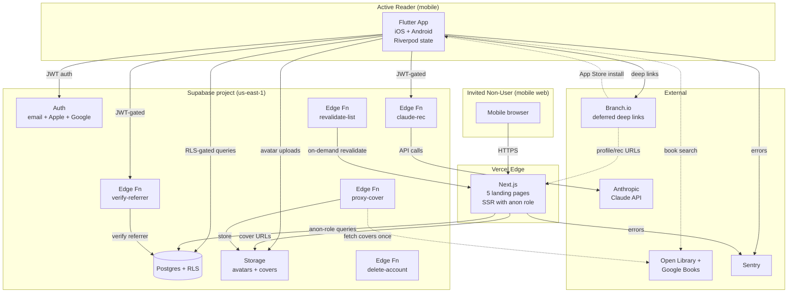
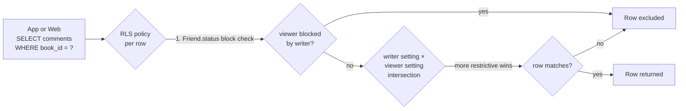
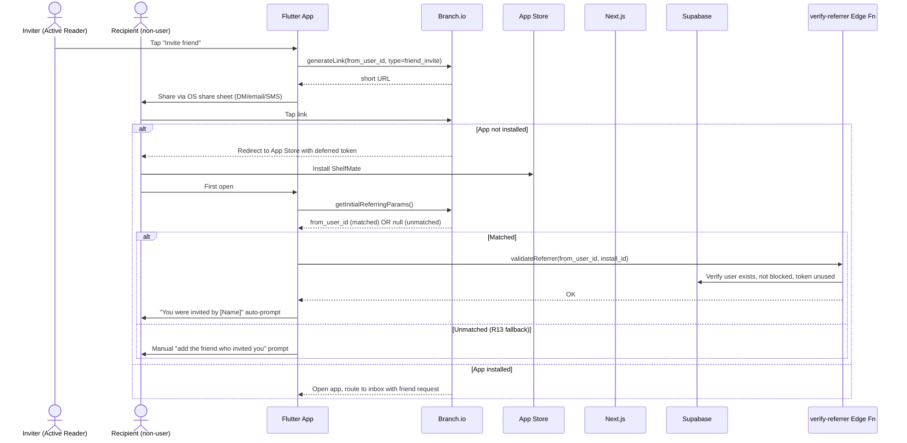
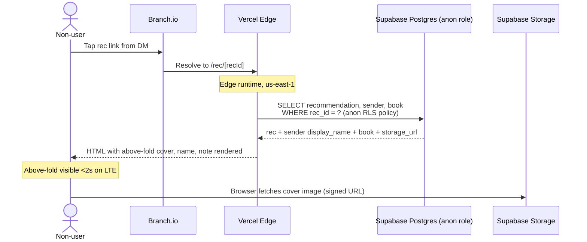

# feat: ShelfMate v1 phased implementation plan

## Summary

Deliver ShelfMate v1 — all 68 buildspec stories on iOS + Android + the five non-user web pages — as eight sequenced implementation units that build foundation infrastructure first, then the privacy-correct data layer, then user-facing features in dependency order, ending with the non-user web conversion surface and beta distribution. Each unit is sized to be a meaningful milestone (multiple buildspec stories per unit) rather than a single PR; finer story-level breakdown happens inside each unit during `/ce-work`.

---

## Problem Frame

Brainstorm produced a fully-locked tech stack (Flutter + Riverpod, Supabase + Postgres + RLS, Next.js on Vercel, Branch.io, GitHub Actions, Sentry) and 28 architectural requirements, but planning still has to answer: in what order do we build, where does each requirement land, and what acceptance signal proves each milestone is complete? The team is one engineer carrying 68 stories with no monetisation runway — sequencing must front-load the trust-critical infrastructure (privacy intersection rule, RLS test gate, account deletion, deferred deep linking) so feature work doesn't have to revisit those decisions, and the conversion surface (non-user web) ships late enough that it has real friend-generated content to render but early enough to drive seeding traction. (See origin: `docs/brainstorms/2026-05-06-tech-stack-architecture-requirements.md`.)

---

## Requirements

This plan delivers all 28 architectural requirements (R1-R28) from origin. Origin requirements are not restated here — see origin for the canonical list. The mapping of origin R-IDs to plan implementation units is captured in each unit's `**Requirements:**` field below.

The plan also delivers all 68 buildspec stories (E1-E11). Story-to-unit mapping appears in each unit's `**Buildspec stories:**` field. Story-level acceptance criteria live in `buildspec/shelfmate_05_stories.docx` and remain authoritative — `/ce-work` will treat each story's acceptance criteria as the implementer-facing checklist when executing within a unit.

**Origin actors:**
- A1 Flutter App (iOS + Android)
- A2 Next.js Web Project (Vercel)
- A3 Supabase Backend
- A4 Branch.io
- A5 Open Library + Google Books APIs
- A6 Anthropic Claude API

**Origin flows:**
- F1 Friend invite link click (deferred deep link)
- F2 Friend's note rendering on book detail (privacy intersection)
- F3 Non-user lands on rec page (2s LTE budget)

**Origin acceptance examples:** AE1-AE11 from origin's Acceptance Examples section. Each AE is bound to a buildspec story plus an implementation unit in this plan; coverage is shown at the unit level via `Covers AE<N>.` prefixes on test scenarios.

---

## Scope Boundaries

This plan executes everything inside the v1 scope contract defined in `buildspec/shelfmate_06_mvp.docx` and the architecture decisions in origin. The single-list of explicit non-goals below is plan-local — see origin for the full v1 Scope Boundaries (which includes rejected stack alternatives, PWA wrappers, etc.).

- Story-level breakdown into PR-sized commits — that is `/ce-work`'s responsibility; this plan stops at the milestone-unit level.
- Sprint planning, calendar dates, or velocity estimates — solo Labs build, no timeline commitments to make.
- Specific Flutter package version pinning — captured at `pubspec.yaml` time during U1 / U3 / per-feature units; verify against current pub.dev when each is added.
- Specific Anthropic Claude model ID selection — origin defers to planning; do final lookup against current Anthropic model lineup at U6 implementation time.
- Final Branch.io tier confirmation — origin flags the "~250K MAU free" claim as needing verification; U1 includes the verification but does not commit to upgrading if the cap is lower.

### Deferred to Follow-Up Work

These items are outside the active plan but tracked here so they don't drift:

- **v1.1 push notifications.** Per origin Dependencies, v1 schema reserves `device_tokens` and `notification_prefs` columns/tables in U2 to avoid retrofit churn — but no push-send code, no APNs/FCM/OneSignal integration, no Inbox push triggers ship in v1.
- **v1.1 analytics platform integration.** v1 ships only the conversion-observability requirement (R27, in U7) via Vercel Web Analytics or equivalent zero-integration path. Mixpanel/Amplitude integration is v1.1.
- **v1.1 admin dashboard, moderation tools, user reporting.** Per spec.
- **Goodreads / StoryGraph CSV import.** Per spec scope contract (P3 backlog).
- **Collaborative lists, multi-recipient recommendations, author follow, reading clubs, reading challenges.** Per spec scope contract.
- **The seven user-decision deferred items** in origin's `### From 2026-05-06 review`. Most are validation tasks (anon-role RLS expressibility, Supabase region selection, RN/Next.js justification re-litigation, R17-R19 framing, R15 narrowing) that don't block this plan from executing — they get revisited during `/ce-work` if implementation surfaces signal that the agent's defaults were wrong. R8 cache invalidation strategy is the exception: this plan picks option (b) explicit broadcast (see Key Technical Decisions below) so U2 / U4 don't have to ask.

---

## Context & Research

### Local research

The repository is greenfield as of 2026-05-06 — only `buildspec/` (7 product spec .docx files), `docs/brainstorms/` (the architecture decision doc), and `docs/plans/` (this file) exist. There is no codebase to mine for existing patterns and no `docs/solutions/` for institutional learnings yet. Phase 1 repo and learnings research were skipped because there was nothing to research.

### Authoritative source documents

- **Origin architecture doc:** [`docs/brainstorms/2026-05-06-tech-stack-architecture-requirements.md`](../brainstorms/2026-05-06-tech-stack-architecture-requirements.md) — locks the tech stack, defines R1-R28, the Privacy Enforcement Seam, Outstanding Questions.
- **Buildspec product spec** (`buildspec/`):
  - `shelfmate_spec.docx` — top-level product spec, conceptual data model
  - `shelfmate_01_personas.docx` — Active Reader (primary), Invited Non-User (growth seam)
  - `shelfmate_02_workflows.docx` — W1-W9 + 3 cross-persona handoffs (H1-H3); demo storyline
  - `shelfmate_03_ia.docx` — IA: 10 conceptual objects, 7 screen patterns, screen anatomy for 6 highest-weight screens
  - `shelfmate_04_handoff.docx` — seam map, shared data dictionary, failure modes for every external/system seam
  - `shelfmate_05_stories.docx` — **68 stories across 11 epics** with acceptance criteria (story-level contract)
  - `shelfmate_06_mvp.docx` — scope contract, in/out list, traction signals

### External references

These are deferred to per-unit implementation rather than pulled into the plan because the architecture doc already settled the technology choices and per-package version pinning is correctly an implementation-time concern. Notable references the implementer will hit:

- **Supabase docs**: RLS policy authoring, Edge Functions (Deno runtime), Auth provider setup (Apple Sign In requires Services ID + .p8 key + signInWithIdToken on iOS), pg_net for webhooks, Storage URL signing.
- **Branch.io Flutter SDK docs**: deferred deep linking on iOS post-Privacy-Manifest, fingerprinting + clipboard fallback semantics, link generation API.
- **Vercel docs**: edge SSR vs serverless functions, on-demand revalidation API, environment scoping.
- **Apple Developer**: App Store Review Guideline §5.1.1 (account deletion required since 2023-06), Privacy Manifest (Required Reason API).
- **Anthropic API**: current Claude model lineup (origin's `claude-sonnet-4-20250514` may have rolled forward).
- **pgTAP**: Postgres unit testing framework for the RLS test suite.
- **Riverpod 2.x + riverpod_generator**: code-gen patterns, `ref.invalidate()` semantics, `autoDispose` lifecycle.

---

## Key Technical Decisions

These are plan-time decisions made on top of origin's architectural decisions. Origin's decisions (Flutter, Supabase, Next.js, Branch, Riverpod, monorepo, ShelfMate name) are not restated.

- **Privacy invalidation pattern: explicit broadcast via a centralized `PrivacyInvalidator` provider** (resolves origin's deferred R8 question). Privacy-setting writes (writer setting, viewer setting, library visibility, currently-reading visibility) call into a single Riverpod provider that holds the registered set of privacy-affected providers and fires `ref.invalidate()` on each. Rationale: option (a) `autoDispose` without `keepAlive` over-fetches on every navigation; option (c) Realtime adds infrastructure for what is genuinely an in-process broadcast. The explicit broadcast pattern keeps R7's "no app-code permission logic" goal intact (the providers themselves don't compute permissions; they just refresh) while avoiding excess traffic.

- **Supabase region: `us-east-1`** (implicit default in origin's deferred Outstanding Question). Aligns with Vercel `iad1` edge default region for the SSR co-location concern. Pinned here so U1 can stand up the project; reopen at beta if global users dominate the seeding pool.

- **Anon-role for Next.js SSR queries** (committed in origin's Privacy Enforcement Seam, validation deferred). The Next.js project uses the Supabase anon key — never the service-role key — for all queries. Each privacy-affected table (`comments`, `book_lists`, `profiles`, `recommendations`, `user_books`) gets an explicit anon-role RLS policy that permits read of rows where the writer's setting is `Everyone` (and, for `book_lists`, `visibility = Public`). U2 implements these policies; U7 consumes them.

- **R17/R18/R19 (CI/CD, Sentry, beta distribution) treated as pre-distribution setup work in U1, not story-equivalent units.** Origin flagged this as a deferred user-decision; deferring it inside the plan keeps story-equivalent work focused on user-visible features. The setup gets explicit unit work in U1 with clear verification criteria, but it doesn't pretend to be a buildspec story.

- **Annual Recap (E8-005) ships in full per spec.** The spec's E8-005 acceptance criteria mandate the variant card ("You've read X books this year — keep going!") for users with `< 5 books read in the year` AND state "Available year-round, not just December" — the variant IS the recap for low-data users by design, not a scope reduction. The plan implements the full surface in U8 (full template for users with `≥ 5 books read in the calendar year`, variant card otherwise). No additional gates beyond the buildspec's `min_books_read >= 5` threshold. The `finished_at::date >= '<current calendar year>'` filter computes the year dynamically; Jan-Feb opens render the previous calendar year if the user has any books finished in it.

- **No Flutter version-pin commitment in this plan.** The engineer's local Flutter is `3.41.8-stable` (per memory of dev environment); the plan assumes Flutter 3.x stable channel and Dart 3.x. Specific version selection happens at `pubspec.yaml` time in U1.

- **Greenfield monorepo at `C:\dev\ShelfMate\`**. The repo root already holds `buildspec/` and `docs/`. U1 adds `app/`, `web/`, `supabase/`, and `.github/` at the same level — no rearrangement of existing dirs.

- **No Postgres extension dependencies beyond `pgcrypto`, `pg_net`, `http` in v1.** RLS, JSONB, generated columns, and standard indexing cover the data needs. Realtime, vector search, and full-text search are out of scope. pgTAP is a *test* dependency, not a production runtime requirement.

---

## Open Questions

### Resolved During Planning

- **R8 cache invalidation strategy** → Resolved as "explicit broadcast via `PrivacyInvalidator`" (see Key Technical Decisions). Origin had this as a deferred user-decision under `### From 2026-05-06 review`.
- **Supabase region** → Resolved to `us-east-1` (see Key Technical Decisions).
- **R15 narrowing** → Resolved to no narrowing (all three branded fallback cases shipped as a single Next.js error-route shape). `buildspec/shelfmate_04_handoff.docx` Phase 4 failure modes confirm the spec's design philosophy is "always branded, never raw 404."
- **R17/R18/R19 framing** → Resolved as "keep as numbered requirements; treat as pre-distribution setup in U1" (see Key Technical Decisions).

### Deferred to Implementation

- **Exact RLS policy SQL for the comment intersection rule.** U2 implements; the helper SQL function shape is an implementation-time decision. The pgTAP suite from R22 acts as the contract.
- **Whether U7 uses Vercel ISR + on-demand revalidation, full SSR, or a hybrid for the public-list and inviter-profile pages.** R10/R11 require the visibility-fresh guarantee; the mechanism is U7's call when implementer measures real-data latencies.
- **Branch.io Flutter SDK behavior on iOS 18+/Android 15+** with current Privacy Manifest enforcement. U3 implements; verify against latest Branch docs and adjust the fallback path (R13) if Branch's match rate has degraded materially.
- **Anthropic Claude model ID** for U6's Claude Edge Function. Verify against current model lineup at U6 implementation time; `claude-sonnet-4-20250514` from origin may have rolled forward.
- **Cover-image proxy implementation: download-once-at-rec-creation vs scheduled refresh.** R12 mandates Supabase Storage hosting; U5 (when it implements rec creation) chooses the refresh policy.
- **RN rejection rationale, Next.js vs alternatives justification, R17-R19 framing meta-decisions.** Origin deferred these as user-decisions; this plan does not re-litigate them. They remain in origin's Outstanding Questions.

### From 2026-05-06 plan-review

Deferred from `/ce-doc-review` round 1 of this plan (2026-05-06). Each item is a real product/architecture decision the user should weigh in on before `/ce-work` commits the plan to execution.

- **[Affects KTD R8 invalidation]** **Plan unilaterally resolved an origin User-Decision item.** Origin marked R8 cache invalidation strategy as `[User decision]` and this plan picked option (b) explicit broadcast without escalating. Choices: (a) accept the plan-time pick and document it as an explicit override, (b) revisit and pick a different option (autoDispose without keepAlive, or Supabase Realtime), or (c) escalate back through `/ce-brainstorm` for formal sign-off.
- **[Affects whole plan]** **Calendar reality / realistic timeline disclosure.** Solo engineer + 68 stories + 8 infrastructure-heavy units = ~10-15 month realistic build under best-case assumptions; plan's "no timeline commitments" framing hides the actual ask. Plus external clocks: App Store / Play Store review queues (1-14 days post-submission with rejection-and-resubmit risk), and the spec's 60-day post-seeding traction-gate clock that starts after U8 ships. Decisions: (a) add a Calendar Reality section with rough order-of-magnitude per Wave; (b) shrink v1 scope (e.g., defer E6 Lists or E8 Share Card customisation to v1.1 to bring the band into 6-8 months); (c) accept the ambiguity deliberately and document the reasoning.
- **[Affects KTD region + R10/F3/AE5]** **`us-east-1` default fails 2s LTE budget for non-US users.** Sydney/Berlin/São Paulo recipients of friend-rec links will see 3-5s above-fold on LTE because of cross-region Postgres latency (the Playwright test from non-US region added in U7 will now surface this). Decisions: (a) accept the regional limitation explicitly and document seeding pool restriction to North American testers in v1; (b) commit to Supabase Pro for read-replica access in EU/APAC regions; (c) materialize landing-page payloads to Vercel Edge KV (or Cloudflare KV) so the cross-region Postgres hop is amortised; (d) wait until beta data confirms which user populations actually exist before deciding.
- **[Affects U8 sequencing]** **U8 bundles too much for one unit.** U8 currently carries Privacy Settings UI + Annual Recap + Account Deletion UI + E11 polish + TestFlight beta + Play Internal beta + App Store submission + Play Store submission + asset production + privacy policy / ToS publication + final regression sweep. Decision: (a) split U8 into U8a "Code+test surface, ends at TestFlight + Play Internal beta" and U8b "Beta distribution, store submissions, asset production, legal docs, final regression"; (b) keep as one unit and accept the calendar bundling risk. The split makes the dependency graph cleaner and gives a clear "code-complete" milestone before launch ops begin.
- **[Affects Phased Delivery / Wave 1]** **Wave 1 demo value framing.** "Sign up works on both platforms" is genuinely an internal milestone, not external demo value. Three months of solo work with no user-visible core loop signal during Wave 1 is a real risk on a Labs project that depends on early seeding feedback. Decisions: (a) restructure to push a thin Add-Book + Library slice (parts of U4) into Wave 1 so the demo actually shows a thing; (b) shrink Wave 1 to U1+U3 only (defer pgTAP suite from U2 until before U5 lands) to compress the no-signal period; (c) honestly relabel Wave 1 as "internal validation milestone — no external demo, expect 2-3 months."
- **[Affects U1 scope clarity]** **U1 cost annotation.** "No buildspec stories" hides ~2-3 stories' worth of engineer-week cost (3 deployable scaffolds, 3rd-party accounts, signing setup, AGENTS.md authoring, GHA secrets configuration, pgTAP runner setup, Apple Sign In Services ID + .p8 setup with multi-day Apple cert propagation). Decision: annotate U1 with an honest effort signal (e.g., "pre-distribution setup, comparable in engineer-cost to ~2-3 user-facing stories") so reviewers calibrating against this plan understand Wave 1's real cost.
- **[Affects U1 secrets / R28]** **GitHub Actions macOS minutes mitigation.** Private-repo free tier is ~200 macOS-minutes/month at 10× multiplier; signed Flutter iOS build is 15-25 min. Math: 8-13 builds before paid kicks in. Across 8 units of PR-driven CI plus integration tests on iOS simulator, the quota is exhausted within weeks of U4. Choices: (a) make the repo public (with secrets-scanning enabled); (b) budget for paid GHA minutes (~$0.08/macOS minute); (c) move iOS CI to Codemagic (500 build minutes/month free, but also limited); (d) self-hosted macOS runner on the engineer's Mac (no quota but only when machine is on); (e) gate iOS integration tests behind a label rather than auto-run on every PR. Pick before U4 ships.
- **[Affects R3, R13 / U3]** **Branch SDK iOS Privacy Manifest match-rate falsification trigger.** Branch's published post-Privacy-Manifest match rates on iOS hover at 30-50% (down from ~80% pre-iOS-14.5). The plan's fallback (manual "add the friend who invited you" prompt) absorbs the unmatched 50-70% but the conversion math is materially worse than implicit assumptions in the plan. Decisions: (a) add pre-launch instrumentation (simulate 10 invite installs, measure matched/unmatched ratio in U3) plus a threshold (e.g., "if <60% on iOS, redesign manual-add UX before launch"); (b) accept Branch's published rate as planning input and adjust seeding-pool projections accordingly; (c) add a parallel invite-code mechanism so the recipient enters a short code during onboarding (works regardless of Branch match rate, but is one more friction step for the matched case).
- **[Affects R27 — defer Supabase-native event log to v1.1]** Plan committed to Vercel Web Analytics for v1 conversion observability and removed the planned Supabase Edge Function event log (closing the SEC-1 abuse surface). Vercel Web Analytics on Hobby tier captures page views and custom events but has limited query capability and 30-day retention. Decision (when v1.1 work begins): does the spec's traction-gate metric need a Supabase-native event log for longer retention or richer queries, and if so, what authentication / rate-limit model addresses the abuse surface that originally surfaced in this review?

---

## Output Structure

The greenfield monorepo layout. Per-unit `**Files:**` sections are authoritative for what each unit creates; this tree shows the expected v1 shape at a glance.

```
ShelfMate/                        # repo root (already C:\dev\ShelfMate)
├── app/                          # Flutter mobile app (iOS + Android)
│   ├── android/                  # platform-specific config
│   ├── ios/                      # platform-specific config
│   ├── lib/
│   │   ├── core/                 # shared infrastructure
│   │   │   ├── auth/             # Supabase Auth bindings
│   │   │   ├── supabase/         # client + typed query helpers
│   │   │   ├── branch/           # Branch SDK init + link generation
│   │   │   ├── sentry/           # error reporting init
│   │   │   ├── observability/    # event logging shims
│   │   │   ├── privacy/          # PrivacyInvalidator provider
│   │   │   └── env/              # env config + secrets
│   │   ├── features/             # feature-first organization
│   │   │   ├── auth/             # E1 — sign up, log in, genre picker
│   │   │   ├── library/          # E2 — search, scan, log, shelves
│   │   │   ├── book_detail/      # E3 — Book Detail screen + actions
│   │   │   ├── friends/          # E4 — invites, profile, block
│   │   │   ├── recommendations/  # E5 — send, inbox, accept/dismiss
│   │   │   ├── lists/            # E6 — create, share, browse
│   │   │   ├── discover/         # E7 — Claude recs, filter chips
│   │   │   ├── share_card/       # E8 — render, customize, export
│   │   │   └── settings/         # E9 — privacy, profile, blocked
│   │   ├── routing/              # app-wide route definitions
│   │   ├── theme/                # design tokens, color, typography
│   │   └── main.dart
│   ├── test/                     # widget + unit tests
│   ├── integration_test/         # end-to-end device tests
│   └── pubspec.yaml
├── web/                          # Next.js for non-user landing pages (E10)
│   ├── app/
│   │   ├── rec/[recId]/page.tsx          # E10-001 Direct Rec Landing
│   │   ├── u/[userId]/page.tsx           # E10-002 + E10-003 Profile
│   │   ├── list/[listId]/page.tsx        # E10-004 Public List
│   │   ├── join/page.tsx                 # E10-005 App Store redirect
│   │   ├── error.tsx                     # branded fallback (R15)
│   │   ├── layout.tsx
│   │   └── globals.css
│   ├── components/                       # shared landing-page UI
│   ├── lib/
│   │   ├── supabase.ts                   # anon-role client
│   │   └── branch.ts                     # link helpers
│   ├── tests/                            # Playwright + component tests
│   └── package.json
├── supabase/
│   ├── migrations/                       # numbered SQL migrations
│   ├── policies/                         # RLS policies organized by table
│   ├── functions/                        # Edge Functions (Deno)
│   │   ├── claude-rec/                   # R5, R24 — Claude proxy
│   │   ├── verify-referrer/              # R26 — Branch token validation
│   │   ├── proxy-cover/                  # R12 — Open Library cover proxy
│   │   ├── delete-account/               # R23 — account deletion orchestration
│   │   └── revalidate-list/              # R11 — Vercel revalidation webhook target
│   ├── seed.sql
│   └── tests/                            # pgTAP suite (R22)
├── docs/
│   ├── brainstorms/                      # already exists
│   ├── plans/                            # already exists
│   └── solutions/                        # populated as learnings emerge
├── buildspec/                            # immutable product spec (already exists)
├── .github/
│   └── workflows/                        # CI for app/, web/, supabase/
├── .gitignore
├── README.md
└── AGENTS.md                             # repo conventions for future agents
```

---

## High-Level Technical Design

> *This illustrates the intended approach and is directional guidance for review, not implementation specification. The implementing agent should treat it as context, not code to reproduce.*

### System architecture



### Comment-visibility intersection (data layer enforcement)



The block check runs **before** the intersection — a non-negotiable per origin R7 + Phase 4 "permission seam." pgTAP suite (R22) gates this in CI across `3 writer settings × 3 viewer settings × 4 friendship states = 36 base assertions per scenario`, plus the NULL/no-row edge cases (writer or viewer setting unset, no friendship row distinct from `status=None`) and symmetric-pair queries (a→b and b→a for every combo to catch canonical-pair-ordering bugs in the `friendships` lookup).

### Friend invite deferred deep link flow (F1 + R13)



### Non-user rec landing 2s LTE budget (F3)



---

## Implementation Units

Eight units, ordered by dependency. Each unit is multiple buildspec stories worth of work. `/ce-work` will break units into PR-sized commits using each story's acceptance criteria from `buildspec/shelfmate_05_stories.docx`.

### U1. Foundation, infrastructure, and CI/CD

**Goal:** Stand up the monorepo, all three deployable skeletons (Flutter app, Next.js web, Supabase project), all third-party accounts (Branch, Vercel, Sentry, Anthropic), GitHub Actions CI/CD with secrets management, and the AGENTS.md repo convention doc. After this unit, every later unit has a working environment to build into.

**Requirements:** R1, R2 (Flutter + Riverpod scaffold), R3 (Branch SDK installed but not yet wired), R16 (monorepo layout per Output Structure), R17 (GitHub Actions for app/web/supabase), R18 (Sentry init in app and web), R19 (TestFlight + Play Internal Testing config), R20 (Open Library client stub), R21 (Anthropic project + monthly cap configured), R28 (secrets management).

**Buildspec stories:** none directly — this is pre-distribution setup per the Key Technical Decision.

**Dependencies:** none.

**Files:**
- Create: `.gitignore`, `README.md`, `AGENTS.md`
- Create: `app/pubspec.yaml`, `app/lib/main.dart`, `app/lib/core/sentry/sentry_init.dart`, `app/lib/core/env/env.dart`, `app/lib/core/supabase/client.dart`, `app/lib/core/branch/branch_init.dart` (init only — usage in U3+)
- Create: `web/package.json`, `web/next.config.js`, `web/app/layout.tsx`, `web/app/globals.css`, `web/lib/supabase.ts`, `web/lib/sentry.ts`
- Create: `supabase/config.toml`, `supabase/seed.sql` (empty), `supabase/migrations/00000000000000_init.sql` (extensions: `pgcrypto`, `pg_net`, `http`)
- Create: `.github/workflows/app-ci.yml` (Flutter analyze + test on push), `.github/workflows/web-ci.yml` (Next.js lint + test + build), `.github/workflows/supabase-ci.yml` (boots the local Supabase stack via `supabase start`, runs migrations, then `supabase test db` — the bundled pgTAP harness in the Supabase Docker image; gates merges on green), `.github/workflows/app-release.yml` (signed iOS + Android builds to TestFlight + Play Internal — manually triggered until U8)
- Create: `app/test/smoke_test.dart` (verifies app boots), `web/tests/smoke.spec.ts` (verifies homepage 200), `supabase/tests/00_smoke.sql` (verifies extensions installed)
- Test: same files above

**Approach:**
- Flutter project initialized with the latest Flutter 3.x stable on engineer's machine; pubspec lists `flutter_riverpod`, `riverpod_annotation`, `riverpod_generator`, `build_runner`, `supabase_flutter`, `flutter_branch_sdk` (canonical maintained Flutter Branch package on pub.dev), `sentry_flutter`, `flutter_secure_storage`, `cached_network_image`, `share_plus`, `mobile_scanner`, `sign_in_with_apple`, `google_sign_in`, `image_picker`, `app_links` (placeholder list — exact versions resolved at `pub get` time).
- Next.js project initialized with App Router, TypeScript strict mode, Tailwind. Dependencies: `@supabase/supabase-js`, `@sentry/nextjs`. **No `branch-sdk` npm dep** — the package depends on `window` / `document` and breaks in Vercel Edge runtime. Build Branch URLs from Branch's documented URL template (`link.shelfmate.app/<token>?<base64-encoded-params>`) in `web/lib/branch.ts` — pure URL assembly, no SDK needed for SSR.
- Supabase project provisioned in `us-east-1` via `supabase init` + project linkage. Secrets stored in GHA encrypted environments scoped to dev/beta/prod (R28).
- Branch.io account created on free tier; verify the actual MAU cap during account setup (origin's deferred question). Generate two link domains: `link.shelfmate.app` (production) and `link-staging.shelfmate.app`.
- Anthropic project created with monthly spend cap configured **before** any Claude API call ships. Cap value: $50/mo for Labs scale (revisit at beta).
- Sentry projects: one for `shelfmate-app` (Flutter), one for `shelfmate-web` (Next.js). DSNs stored as GHA secrets and injected at build time. **Configuration on both clients**: `sendDefaultPii: false` (no automatic PII capture), `tracesSampleRate: 0.1` (sample 10% of traces to stay under free-tier quotas), `maxBreadcrumbs: 30` (down from default 100 to stay under per-event size budgets), `beforeSend` callback that (a) strips any event payload matching patterns for user IDs, display names, personal note content, friend list members, and Branch token values, and (b) deduplicates by `error_signature` (error type + screen + first stack frame) within a 60-second sliding window per session — single bug in a frequently-rendered widget cannot blow the 5K errors/month free-tier cap. Document the PII exclusion policy and the dedup window in `docs/observability.md` so the engineer knows what data Sentry will and will not see when debugging.
- iOS signing: Apple Developer Program enrollment (engineer responsibility), provisioning profile + signing cert generated, fastlane Match or manual `.p12` upload to GHA secrets. Android signing: keystore generated, password stored as GHA secret.
- **Apple Sign In configuration up-front** (load-bearing for U3): in the Apple Developer console, create a Services ID for ShelfMate's web-OAuth path with the return URL `https://<project>.supabase.co/auth/v1/callback`; generate a Sign In with Apple key (`.p8`); populate Supabase Auth Apple provider with the team ID, key ID, and `.p8` contents (production key separate from dev). Both the native iOS Bundle ID and the Services ID need to be associated with the same Sign In with Apple key. Without this, U3 stalls waiting on Apple cert propagation (multi-day in some cases).
- AGENTS.md establishes: Dart formatter convention, RLS policy file naming, migration naming (`YYYYMMDDHHMMSS_<slug>.sql`), test colocation rule, Riverpod codegen invocation pattern.

**Patterns to follow:**
- Standard Flutter project layout per `flutter create`.
- Standard Next.js App Router layout.
- Standard Supabase project layout per `supabase init`.

**Test scenarios:**
- Happy path: `flutter test` exits 0 against the smoke test (verifies app initializes, Riverpod root is constructed, Sentry init does not crash with placeholder DSN).
- Happy path: `npm test` against `web/tests/smoke.spec.ts` returns 200 for `/` and verifies Sentry init.
- Happy path: `supabase db reset` succeeds and `pgcrypto`, `pg_net`, `http` extensions are present (single SQL assertion).
- Happy path: GHA workflows for `app-ci`, `web-ci`, `supabase-ci` all green on a manually-triggered run with empty PR.
- Edge case: GHA macOS build of Flutter iOS produces a signed `.ipa` artifact that uploads successfully to TestFlight (manually triggered `app-release.yml`).

**Verification:**
- Engineer can clone the repo on a fresh machine, run setup commands documented in README.md, and have all three deployables build locally.
- All four GHA workflows trigger and complete green.
- Sentry projects show "ready to receive events" status.
- Branch.io dashboard shows active project with `link.shelfmate.app` configured.
- Anthropic console shows the project with the spend cap set.

---

### U2. Data layer with privacy enforcement and RLS test gate

**Goal:** Implement the full v1 Postgres schema, the RLS policy set that enforces the comment-visibility intersection rule + block enforcement + non-user anon-role reads, the pgTAP test suite that gates all 9 writer × viewer × 4 friendship-state combos in CI, the account-deletion orchestration Edge Function, and the v1.1 push-notification schema reservation. After this unit, the data layer is privacy-correct and any feature unit can build queries without inventing permission logic.

**Requirements:** R4 (Supabase project usage), R6 (Friendship state model), R7 (intersection rule via RLS), R8 (privacy setting changes propagate — schema + invalidation hooks), R12 (cover URL on `Recommendation` record schema), R22 (RLS test suite), R23 (account deletion architecture), origin Privacy Enforcement Seam (all four scenarios: edge SSR auth via anon-role policies, Realtime invalidation hook, RLS join composition, migration discipline).

**Buildspec stories:** no direct user-facing stories, but unblocks every later unit.

**Dependencies:** U1.

**Files:**
- Create: `supabase/migrations/00000000000001_schema_users.sql` (users, privacy_settings, profiles)
- Create: `supabase/migrations/00000000000002_schema_books.sql` (books cache, user_books with status enum)
- Create: `supabase/migrations/00000000000003_schema_friendships.sql` (friendships with canonical pair ordering, status enum, blocked_by)
- Create: `supabase/migrations/00000000000004_schema_recommendations.sql` (recommendations with status enum, sender/recipient FKs, note, cover_storage_url for R12)
- Create: `supabase/migrations/00000000000005_schema_book_lists.sql` (book_lists, book_list_items with ordering, book_list_shares, book_list_visibility enum)
- Create: `supabase/migrations/00000000000006_schema_ai_recs.sql` (ai_rec_cache, ai_not_interested signals)
- Create: `supabase/migrations/00000000000007_schema_push_reservation.sql` (device_tokens, notification_prefs — schema only, no triggers; reserved per origin Dependencies)
- Create: `supabase/migrations/00000000000010_function_visibility.sql` (`fn_can_see_comment(viewer_id uuid, writer_id uuid)` SQL function — looks up both privacy settings from `privacy_settings` table internally; tamper-proof because `viewer_id` always sourced from `auth.uid()`)
- Create: `supabase/migrations/00000000000011_function_block_check.sql` (`fn_is_blocked(viewer_id, other_id)` returning boolean)
- Create: `supabase/migrations/00000000000020_rls_user_books.sql`, `supabase/migrations/00000000000021_rls_friendships.sql`, `supabase/migrations/00000000000022_rls_recommendations.sql`, `supabase/migrations/00000000000023_rls_book_lists.sql`, `supabase/migrations/00000000000024_rls_comments.sql`, `supabase/migrations/00000000000025_rls_profiles.sql`, `supabase/migrations/00000000000026_rls_anon_reads.sql` (anon-role policies for the four E10 surfaces)
- Create: `supabase/migrations/00000000000030_account_deletion.sql` (FK ON DELETE policies: cascade for user-owned data, SET NULL with anonymisation trigger for recommendations.sender, soft-delete for book_lists with public visibility flagged)
- Create: `supabase/functions/delete-account/index.ts` (Edge Function orchestrating: auth verify → set `users.deletion_in_progress = true` (RLS-blocked write surface for the deleted user) → anonymise outbound recs → write `invalidated=true` rows into `consumed_tokens` for any unconsumed Branch token associated with this user (closes the deletion-race window where a future install of an unconsumed token would re-link to the deleted user) → delete user data → delete auth row → emit Sentry event for audit trail)
- Create: `supabase/tests/01_visibility_intersection.sql` (pgTAP — `fn_can_see_comment` direct call matrix: `(3 writer settings + NULL) × (3 viewer settings + NULL) × (4 friendship states + 'no friendship row') = 80 assertions`, generated via CROSS JOIN to enumerate the full grid including unset / missing-row edge cases)
- Create: `supabase/tests/02_rls_comments.sql` (pgTAP — same matrix but exercised via SELECT against the `comments` table with RLS active; `3 writer settings × 3 viewer settings × 4 friendship states = 36 assertions per scenario`)
- Create: `supabase/tests/03_rls_blocked.sql` (pgTAP — block-before-intersection ordering: writer setting Everyone + viewer setting Everyone + Friendship.status Blocked → row excluded)
- Create: `supabase/tests/04_rls_anon_reads.sql` (pgTAP — anon-role policy verification: writer Everyone visible, writer Friends/Only-me invisible)
- Create: `supabase/tests/05_account_deletion.sql` (pgTAP — deletion cascade verification, recommendation anonymisation verification)
- Modify: `.github/workflows/supabase-ci.yml` (verify the `supabase start` + `supabase test db` flow from U1 actually runs the test suite; gate merges on green)
- Test: all `supabase/tests/*.sql` files

**Approach:**
- Schema follows the conceptual model in `buildspec/shelfmate_03_ia.docx` §1: 10 objects (User, UserBook, Friend, Recommendation, BookList, Comment, Profile, AIRec, ShareCard, Notification). ShareCard is in-app render only — no DB table. Notification is the Inbox feed — derived from `recommendations`, `friendships`, future push events. Comment is a column on `user_books` (per the spec's data model — note text + visibility flag).
- Friendship row uses canonical pair ordering: `user_id_a < user_id_b` always, with `initiated_by`, `status` enum (`pending`, `active`, `blocked`), `blocked_by` (NULL unless status=blocked). Index on `(user_id_a, user_id_b)`. Helper SQL view `friendship_for(a, b)` normalizes lookups.
- Visibility intersection function `fn_can_see_comment(viewer_id uuid, writer_id uuid)` — both privacy settings looked up from the `privacy_settings` table inside the function so they are tamper-proof (the `viewer_id` is set by `auth.uid()` from the JWT, not the client; `set_config()` and `current_setting()` are explicitly NOT used because they are client-controllable in the Postgres session and would break the trust model):
  1. If `viewer_id = writer_id` → true (always see own).
  2. If `viewer_id IS NOT NULL AND fn_is_blocked(viewer_id, writer_id)` → false (block before intersection — non-negotiable per origin).
  3. Look up `writer.writer_setting` from `privacy_settings WHERE user_id = writer_id` (defaults to `'Everyone'` if NULL/unset).
  4. If `viewer_id IS NULL` (anon role / non-user web): return `writer_setting = 'Everyone'` AND not blocked. Else look up `viewer.viewer_setting` from `privacy_settings WHERE user_id = viewer_id` (defaults to `'Everyone'`).
  5. Compute friendship status via `fn_friendship_status(viewer_id, writer_id)`; intersect writer setting × viewer setting per "more restrictive wins."
  6. Return boolean.
- RLS policy on `comments` table: `USING (fn_can_see_comment(auth.uid(), writer_id))`. The function call resolves `auth.uid()` from the JWT (set by Supabase Auth, not the client) and looks up both privacy settings server-side from `privacy_settings` — there is no client-supplied input that can spoof viewer setting. For anon-role queries (Next.js SSR), `auth.uid()` returns NULL and the function takes the anon branch in step 4.
- Account deletion via Edge Function (not direct SQL) so the FK cascade ordering, recommendation anonymisation, Storage object cleanup, and Branch token cleanup happen in a transaction with audit logging. Apple Review §5.1.1 requires user-initiated deletion accessible without contacting support — surfaced in U8's settings UI.
- Realtime invalidation handled at the app layer via the `PrivacyInvalidator` (per Key Technical Decisions); no DB-side Realtime infrastructure required for v1. Schema reservation only.
- Migration discipline (4th Privacy Enforcement Seam item): every migration that touches `comments`, `user_books`, `friendships`, `book_lists`, `privacy_settings` MUST include an accompanying RLS policy update in the same commit. AGENTS.md states this rule; PR template has a checklist; CI runs the pgTAP suite against the proposed schema before merge.

**Patterns to follow:**
- pgTAP idioms: `is(...)`, `ok(...)`, `bag_eq(...)` for set comparisons.
- Supabase migration naming: `YYYYMMDDHHMMSS_<descriptive_slug>.sql`.

**Test scenarios:**
- Happy path: `fn_can_see_comment` direct call returns true for matching cases; `pgtap` suite green on all 9 × 4 combos. **Covers AE1, AE2.**
- Edge case: NULL viewer_id (anon role) sees only writer_setting=Everyone rows; passes the anon-policy test in `04_rls_anon_reads.sql`.
- Edge case: User has no friendships at all (NULL row in `friendships` for the pair) — block check returns false; intersection runs as if status=None.
- Edge case: User A sent a friend request to B (status=Pending); A's writer_setting=Friends-only — B does NOT see A's comments yet (Pending != Active per R6).
- Error path: User A blocked user B; A's writer_setting=Everyone, B's viewer_setting=Everyone — pgTAP confirms the row is excluded by `fn_is_blocked` BEFORE the intersection runs. **Covers AE2.**
- Integration: Privacy setting write triggers no DB-side action (the app-layer invalidation handles fan-out); pgTAP confirms the new setting is reflected on the next SELECT via `current_setting()` lookup. **Covers AE3 partial — full AE3 verification requires U4 app code.**
- Integration: Migration adding a new column to `user_books` without an accompanying RLS update fails the pgTAP suite at PR-time. (This is a meta-test of the discipline — implemented by extending the pgTAP suite in U2 to fail loudly when a privacy-affected table changes structure without a corresponding policy update; uses Postgres catalog introspection.)
- Happy path: `delete-account` Edge Function deletes a user and anonymises their outbound recommendations; pgTAP verifies `recommendations.sender_display_name = 'A ShelfMate user'` post-deletion.
- Edge case: `delete-account` called twice for same user — second call returns 404, no DB damage.

**Verification:**
- All 5 pgTAP test files green via `supabase test` locally and in CI.
- `supabase-ci.yml` blocks merges when any pgTAP assertion fails.
- Manual SQL session: switching JWT to a blocked user returns zero rows from `SELECT * FROM comments WHERE book_id = ?` for any block target; switching to anon role returns only writer_setting=Everyone rows.
- The PR template includes the privacy-migration checklist.

---

### U3. Auth, onboarding, and Branch SDK foundation

**Goal:** Ship the full E1 Auth & Onboarding epic — sign up via email/Apple/Google, log in, genre taste picker, deferred-deep-link referrer connect, first-book activation prompt — and wire up the Branch SDK in Flutter end-to-end so subsequent units can depend on deep-link infrastructure being live. After this unit, a new user can install the app from a friend invite link and complete onboarding with the friend already connected.

**Requirements:** R3 (Branch SDK Flutter integration — full wiring), R4 (Supabase Auth for all 3 methods), R13 (best-effort referrer survival with documented fallback), R26 (Branch token server-side validation Edge Function), origin Apple Sign In configuration dependency.

**Buildspec stories:** E1-001, E1-002, E1-003, E1-004, E1-005, E1-006, E1-007.

**Dependencies:** U1, U2.

**Files:**
- Create: `app/lib/core/auth/supabase_auth.dart` (sign-up + login wrappers, session restoration), `app/lib/core/auth/auth_providers.dart` (Riverpod auth state)
- Create: `app/lib/core/branch/branch_service.dart` (init, link generation, getInitialReferringParams, getLatestReferringParams)
- Create: `app/lib/features/auth/presentation/sign_up_screen.dart`, `app/lib/features/auth/presentation/log_in_screen.dart`, `app/lib/features/auth/presentation/genre_picker_screen.dart`, `app/lib/features/auth/presentation/referrer_connect_screen.dart`, `app/lib/features/auth/presentation/first_book_prompt_screen.dart`
- Create: `app/lib/features/auth/data/genre_repository.dart` (writes to `users.genre_preferences` JSONB)
- Create: `app/lib/features/auth/data/referrer_repository.dart` (calls `verify-referrer` Edge Function)
- Create: `supabase/functions/verify-referrer/index.ts` (validates Branch token: referrer user_id exists + not blocked + token unused; consumes token on success)
- Create: `supabase/migrations/00000000000040_referrer_tokens.sql` (consumed-tokens table for replay protection — `(token_hash PRIMARY KEY, consumed_at, install_id, invalidated boolean DEFAULT false)`. `verify-referrer` checks for both consumed AND invalidated rows; `delete-account` writes `invalidated=true` rows for any unconsumed tokens to close the deletion-race window.)
- Modify: `app/lib/main.dart` (route based on auth state + referrer presence)
- Modify: `app/ios/Runner/Info.plist` (Apple Sign In capability, Branch URL schemes, Privacy Manifest entries)
- Modify: `app/android/app/src/main/AndroidManifest.xml` (Branch intent filters, Google Sign In config, Apple Sign In Android App Links intent filter for the Supabase callback domain)
- Create: `web/public/.well-known/assetlinks.json` (Android App Links domain verification for the Apple Sign In Android web-OAuth redirect)
- Test: `app/test/features/auth/sign_up_test.dart`, `app/test/features/auth/genre_picker_test.dart`, `app/test/features/auth/referrer_connect_test.dart`, `app/integration_test/auth_e2e_test.dart`, `supabase/tests/06_verify_referrer.sql`

**Approach:**
- Sign In with Apple on iOS: `sign_in_with_apple` package returns Apple identity token natively; Supabase Auth `signInWithIdToken` accepts the token directly. No OAuth web redirect on iOS.
- Sign In with Apple on Android: invokes `SignInWithApple.getAppleIDCredential(webAuthenticationOptions: WebAuthenticationOptions(clientId: SERVICES_ID, redirectUri: SUPABASE_CALLBACK))` — uses the Apple Developer Services ID and `.p8` key configured in U1. The returned identity token still flows through Supabase Auth `signInWithIdToken`. The redirect URI must use https with **Android App Links** (domain-verified via `assetlinks.json` hosted at the project domain) — not a custom URI scheme, which is hijackable on Android by other apps registering the same scheme. Supabase Auth's PKCE + state-parameter handling in `signInWithOAuth` covers CSRF protection for the redirect.
- Google Sign In uses `google_sign_in` package, retrieves ID token, hands to Supabase Auth `signInWithIdToken`.
- Email auth via Supabase's built-in email/password flow with email verification enabled (configurable per spec — defer to spec for whether v1 enforces verification; assume yes for safety).
- Branch SDK init in `main.dart` before Riverpod root. `getInitialReferringParams()` (one-shot) consumed during first-launch detection; `getLatestReferringParams()` listened on cold start for in-session deep-link handling.
- Referrer flow: on first app open after install, Branch returns referrer params (or null if unmatched). If params present, app calls `verify-referrer` Edge Function with the referrer `from_user_id` + the install's unique ID. Edge Function verifies the user exists, is not blocked relative to the new user, and atomically claims the token via `INSERT INTO consumed_tokens (token_hash, install_id, consumed_at) VALUES ($1, $2, NOW()) ON CONFLICT (token_hash) DO NOTHING RETURNING id` — a NULL return means another install already consumed the token (replay rejection). The function also rejects if the referrer's user row carries `deletion_in_progress = true` OR is missing entirely (account deleted). On success, surfaces the friend-connect prompt during onboarding (after genre picker per E1-006). On any failure (unmatched, expired, replayed, deleted referrer), the manual "add the friend who invited you" prompt appears instead — no error attribution per R13.
- Genre picker writes JSONB array to `users.genre_preferences` (or a dedicated table — implementation choice during U3). Genre list comes from `buildspec/shelfmate_05_stories.docx` E1-005: 12-16 from a fixed enum. At least 3 required; skip allowed.
- First book prompt is a Library tab empty state with a prominent Add button — covered visually in U4's library implementation, but the empty-state copy + activation event tracking lands in U3 per E1-007's dependency graph. The Add button kick-off invokes U4's Add Book search flow (which exists by U4 completion).

**Execution note:** Test-first for the referrer flow — its observable behavior across the install boundary is hard to debug live. Integration test that simulates a Branch payload arriving on first init, verifies the Edge Function call and the friend-connect prompt rendering.

**Patterns to follow:**
- Riverpod `authStateChangesProvider` mirrors Supabase's `onAuthStateChange` stream.
- Repository pattern: `AuthRepository`, `GenreRepository`, `ReferrerRepository` — Riverpod-provided via `riverpod_generator`.
- Screen-per-route under `features/auth/presentation/`.

**Test scenarios:**
- Happy path: User signs up with email + password, receives verification email (mocked), enters genre picker, selects 3 genres, lands on Library empty state with first-book prompt. **Covers buildspec E1-001, E1-005, E1-007.**
- Happy path: User taps Sign in with Apple, completes Apple sheet, identity token exchanges with Supabase, account created, lands on genre picker. **Covers E1-002.**
- Happy path: User taps Sign in with Google, completes Google sheet, ID token exchanges with Supabase, account created with display name + avatar pre-populated, lands on genre picker. **Covers E1-003.**
- Happy path: Returning user logs in with email + password, lands on Library tab. **Covers E1-004.**
- Happy path: User installed via friend invite link with successful Branch match. After genre picker, sees "You were invited by [Name]. Add them as a friend?" prompt. Tapping Yes creates a `pending` friendship row. **Covers AE7, E1-006.**
- Edge case: Friend invite link install with Branch match failure (denied tracking). After genre picker, sees manual "add the friend who invited you" prompt with a search field — no error message attributing the failed match. **Covers AE8.**
- Edge case: Sign-up with duplicate email returns inline "An account with this email already exists" — form data preserved. **Covers E1-001 acceptance criteria.**
- Edge case: Apple Sign In cancellation returns user to auth screen with no error toast.
- Error path: `verify-referrer` Edge Function returns 401 (token replay) — onboarding does NOT create the friendship; UX falls through to manual-add path. **Covers AE11.**
- Error path: Network error during sign-up — error message + retry button, form data not lost.
- Edge case: User picks "Skip" on genre picker — Library empty state shows generic prompt; Discover tab will show empty state until 3+ rated books exist.
- Integration: pgTAP test for `verify-referrer` confirms the consumed-tokens table prevents replay (calling twice with same token + different install_ids → second call rejected). **Covers R26.**

**Verification:**
- Fresh app install on iOS simulator + Android emulator: complete the auth flow with each of the 3 methods.
- Branch dashboard shows install events fire correctly for both matched and unmatched referrer cases.
- Manual test: tap a friend invite link on a fresh device, install, open — referrer-connect prompt surfaces (or manual fallback if unmatched).
- All `app/test/features/auth/*` widget tests green.
- `app/integration_test/auth_e2e_test.dart` green on both platforms.
- pgTAP `06_verify_referrer.sql` green.

---

### U4. Library, book detail, finish-book flow, and share card

**Goal:** Ship the full E2 (Book Logging — Library) and E3 (Book Detail) epics, plus the share-card portion of E8 (E8-001 through E8-004 — annual recap deferred to U8). After this unit, an Active Reader can search for a book, log it to any of three shelves, rate it, write a note, browse it on a beautiful Book Detail page, mark it as Read with the celebration moment, and share a polished card to social. This is the product's signature single-user surface.

**Requirements:** R12 (cover proxy through Supabase Storage), R20 (Open Library + Google Books fallback), R25 (magic-moment seam: finish-book + share card + OS share sheet + cover-fallback).

**Buildspec stories:** E2-001 through E2-012 (12 stories), E3-001 + E3-003 through E3-006 (5 stories — E3-002's "Adjust who you see" inline link is stubbed in U4 because it depends on E9-001/E9-002 which ship in U8; E3-002 completes in U8), E8-001 through E8-004 (4 stories).

**Dependencies:** U1, U2, U3 (auth required for any logged actions).

**Files:**
- Create: `app/lib/core/books/open_library_client.dart`, `app/lib/core/books/google_books_client.dart`, `app/lib/core/books/book_search_service.dart` (search facade with fallback)
- Create: `app/lib/features/library/data/user_book_repository.dart`
- Create: `app/lib/features/library/presentation/library_screen.dart` (3 sub-tabs), `app/lib/features/library/presentation/library_search_screen.dart` (E2-012), `app/lib/features/library/presentation/add_book_screen.dart` (E2-001 + E2-002 scanner via `mobile_scanner`)
- Create: `app/lib/features/book_detail/presentation/book_detail_screen.dart` (full anatomy per `shelfmate_03_ia.docx` §4.1: header, rating row, note area, friend activity strip placeholder until U5, action row), `app/lib/features/book_detail/presentation/book_cover_full_screen.dart`
- Create: `app/lib/features/book_detail/presentation/finish_book_flow.dart` (E2-005 — rating step, note step, celebration screen with animation), `app/lib/features/book_detail/presentation/celebration_screen.dart`
- Create: `app/lib/features/share_card/presentation/share_card_screen.dart` (preview), `app/lib/features/share_card/data/share_card_renderer.dart` (CustomPaint → PNG via `dart:ui`)
- Create: `app/lib/features/share_card/data/share_card_exporter.dart` (uses `share_plus` for OS share sheet)
- Create: `supabase/functions/proxy-cover/index.ts` (R12 — fetch from Open Library or Google Books on rec creation, store in Supabase Storage `covers/` bucket, return Storage URL)
- Create: `supabase/migrations/00000000000041_storage_buckets.sql` (covers bucket public read with signed-URL access for sensitive ops)
- Modify: `app/lib/features/auth/presentation/first_book_prompt_screen.dart` (links to Add Book — completing U3's stub)
- Test: `app/test/features/library/*`, `app/test/features/book_detail/*`, `app/test/features/share_card/share_card_renderer_test.dart` (golden image test for the rendered PNG), `app/integration_test/finish_book_flow_test.dart`

**Approach:**
- Book search service queries Open Library first (`/search.json?q=...&fields=...`), falls back to Google Books if no results or no cover. Both clients use exponential backoff (1s, 2s, 4s — 3 attempts) and cache results in SQLite via `sqflite` (7-day TTL per spec). ISBN search uses Open Library's `/isbn/{isbn}.json` endpoint when search input matches ISBN-10/13 regex.
- Add Book flow: search screen → result tap → preview with cover + metadata + shelf picker (Reading / Read / Want to Read) → if Read selected, finish-book flow triggers (E2-003). Adding to Reading or Want to Read returns to Library with a confirmation toast.
- Finish-book flow is a full-screen sequence: rating step (1-5 stars, half-star, Done skips) → note step (optional text field, keyboard does NOT auto-open per spec) → celebration screen (book cover, subtle scale+fade animation, two CTAs: "Share this read" + "Back to library"). Total time budget < 90s end to end. The celebration screen IS the magic-moment seam — animation polish is a product requirement, not a stretch.
- Share card render: Flutter `CustomPaint` writes book cover (cached locally), title, author, star rating (toggleable), display name (toggleable), ShelfMate wordmark to a 9:16 PNG (1080×1920) via `Picture.toImage`. No platform plugin — pure Dart canvas. Cover-unavailable fallback: text-only card on brand-coloured background per spec. **Covers AE9.**
- Share card export: `share_plus.shareXFiles()` with the rendered PNG file + a suggested caption pre-populated with the book title and the user's profile link (deep link from U5/U8).
- Book Detail anatomy per `shelfmate_03_ia.docx` §4.1: header (cover left ~40% / title-author-year right + status pill), rating row (filled stars or tappable empty stars), note area (own note first, "Friends" section placeholder until U5 wires friend notes), friend activity strip placeholder (U5 wires), action row (Recommend [stub until U5], Add to List [stub until U5], Share Card [active]), description with "Read more" expand. Persistent action row across scroll.
- Reading progress (E2-008) writes `user_books.progress_page` and renders a progress bar on Library > Reading sub-tab cards.
- Library search (E2-012) queries local SQLite mirror of `user_books` for instant filter; when searched book is not in shelf, "Not in your library. Want to add it?" shortcut to Add Book.
- Cover proxy (`proxy-cover` Edge Function) is invoked **only at rec creation (U5)** and at AI-rec resolution (U6) — surfaces where a `Recommendation` or `ai_rec_cache` row holds the Storage URL. The finish-book flow does NOT invoke `proxy-cover` because no `Recommendation` row exists at finish-book time and the share card renders from the locally-cached Open Library URL via `cached_network_image`. The function fetches from Open Library, stores in Supabase Storage with a content-addressed filename (`covers/<book_id>.jpg`), returns the public Storage URL. Idempotent (re-calls are no-ops).

**Execution note:** Golden-file test for the share card renderer — pixel-comparing the rendered PNG against committed reference images for both the cover-present and cover-fallback variants. This is the only reliable way to catch regressions in the magic-moment visual.

**Patterns to follow:**
- Repository pattern from U3.
- Riverpod `AsyncValue` for all network-bound state.
- Bottom-sheet for shelf picker, full-screen-sheet for Add Book flow per `shelfmate_03_ia.docx` §5 screen vocabulary.

**Test scenarios:**
- Happy path: User taps Add → searches "Project Hail Mary" → Open Library returns result with cover → user taps result → preview opens → user picks Read → finish-book flow runs (rate 5 stars, write note, celebration) → returns to Library with the book on Read shelf.  **Covers buildspec E2-001, E2-003, E2-004, E2-005, E2-006, E2-010.**
- Happy path: User scans an ISBN with `mobile_scanner` → ISBN passed to Open Library → result returned → preview → shelf picker → adds to Want to Read. **Covers E2-002, E2-011.**
- Happy path: User opens Book Detail for a book on their Read shelf → sees their own rating + note → action row visible → taps Share Card → polished card renders → exports via OS share sheet. **Covers E3-001, E8-001, E8-002, E8-004.**
- Happy path: User adjusts share card customise toggles (rating on/off, name on/off) → preview updates in real time → exports. **Covers E8-003.**
- Edge case: Open Library returns no results AND Google Books returns no results → manual entry option (title + author only) shown.
- Edge case: User searches by ISBN that returns no cover → preview shows generic book-spine placeholder; finish-book share card uses text-only fallback. **Covers AE9.**
- Edge case: User changes a book from Want to Read → Reading → progress bar appears once they log progress. **Covers E2-007, E2-008, E2-009.**
- Edge case: User searches own library for a book they have not logged → "Not in your library" message + shortcut to Add Book. **Covers E2-012.**
- Error path: Open Library API timeout → cached results shown if present; manual entry fallback; user is never blocked from logging.
- Error path: Cover image URL returns 404 during share-card render → text-only fallback card generated; no broken-image artifact.
- Integration: Finish-book flow start → marks `user_books.status = 'Read'` → completes within 90s on a real device using locally-cached cover only (no `proxy-cover` Edge Function call at finish-book time). **Covers R25.**
- Integration: Share card PNG generated with cover + rating + name renders within 800ms on iPhone 12 (acceptable headroom under the 90s overall budget).

**Verification:**
- Manual: log a book end-to-end on iOS and Android; finish-book celebration plays; share card exports cleanly to Instagram, iMessage, and Save to Camera Roll.
- All widget tests in `app/test/features/library/` and `app/test/features/book_detail/` green.
- `app/integration_test/finish_book_flow_test.dart` green on both platforms.
- Share card golden-image tests green for both cover-present and cover-fallback variants.
- Library screen empty-state copy matches `buildspec/shelfmate_05_stories.docx` E2-009 / E2-010 / E2-011 acceptance criteria verbatim.

---

### U5. Friends, recommendations, and book lists (the social layer)

**Goal:** Ship the full E4 (Friends), E5 (Recommendations), and E6 (Book Lists) epics — the social layer that turns ShelfMate from a single-player tracker into a closed-friend-graph product. After this unit, an Active Reader can invite friends via link, accept/deny requests, view a friend's profile (library + lists + comments tabs), block, send a recommendation with a personal note, receive recs in their inbox, accept/dismiss them, create curated lists, share with specific friends or publicly, and browse friends' shared lists. Branch link generation for all three link types (rec, profile, friend invite) lights up here. Book Detail's friend-aware sections (friend notes inline, friend activity strip) get wired in this unit.

**Requirements:** R3 (Branch link generation for all 3 link types), R6 (Friendship state model — fully exercised), R7 + R8 (intersection rule applied to friend notes UX), R26 (Branch token validation already built in U3, exercised here for incoming friend invites).

**Buildspec stories:** E4-001 through E4-006 (6 stories), E5-001 through E5-005 (5 stories), E6-001 through E6-007 (7 stories).

**Dependencies:** U2 (data layer), U3 (auth + Branch SDK foundation), U4 (Book Detail must exist to receive social-layer wiring).

**Files:**
- Create: `app/lib/features/friends/data/friend_repository.dart`, `app/lib/features/friends/data/invite_link_service.dart` (Branch link gen for E11-003)
- Create: `app/lib/features/friends/presentation/friends_screen.dart` (manage list + Add Friend), `app/lib/features/friends/presentation/friend_profile_screen.dart` (Library / Lists / Comments sub-tabs), `app/lib/features/friends/presentation/incoming_request_card.dart`
- Create: `app/lib/features/recommendations/data/rec_repository.dart`, `app/lib/features/recommendations/data/rec_link_service.dart` (Branch link gen for E11-001)
- Create: `app/lib/features/recommendations/presentation/inbox_screen.dart` (E5-002 — Inbox tab), `app/lib/features/recommendations/presentation/send_rec_sheet.dart` (full-screen sheet), `app/lib/features/recommendations/presentation/rec_history_screen.dart` (E5-005)
- Create: `app/lib/features/lists/data/book_list_repository.dart`, `app/lib/features/lists/data/list_share_service.dart` (Branch link gen for public lists feeds into E10-004)
- Create: `app/lib/features/lists/presentation/lists_screen.dart` (My Lists + Shared with Me), `app/lib/features/lists/presentation/list_detail_screen.dart`, `app/lib/features/lists/presentation/create_list_screen.dart`, `app/lib/features/lists/presentation/list_share_sheet.dart`
- Create: `app/lib/core/branch/profile_link_service.dart` (E11-002 — profile deep link generation for share cards in U4)
- Modify: `app/lib/features/book_detail/presentation/book_detail_screen.dart` (wire friend notes section + friend activity strip + Recommend action + Add to List action)
- Modify: `app/lib/features/share_card/data/share_card_exporter.dart` (caption now includes profile deep link from `profile_link_service`)
- Test: `app/test/features/friends/*`, `app/test/features/recommendations/*`, `app/test/features/lists/*`, `app/integration_test/social_e2e_test.dart` (multi-user simulated scenario), `supabase/tests/07_friend_visibility.sql`, `supabase/tests/08_rec_status.sql`

**Approach:**
- Friend invite generates a Branch link with `from_user_id` + `link_type=friend_invite`. Recipient taps the link: if app installed → opens to incoming-request inbox; if not → App Store install + deferred resolution per U3 logic. Existing-user case (open-app branch) creates a `pending` friendship row directly via Supabase.
- Friend profile renders Library / Lists / Comments sub-tabs. Each tab queries with RLS active — the user's own JWT means the intersection rule + block check from U2 handle visibility automatically. The app code does NOT filter rows; it renders what RLS returns. **Covers AE1, AE3 — full validation that the U2 RLS surface composes correctly with friend UI queries.**
- Block (E4-004) writes `friendships.status = 'blocked'`, `blocked_by = current_user_id`. App-side: invalidate all `Privacy`-affected providers and the friend list provider via `PrivacyInvalidator`. UX: blocked user's content disappears from the blocker's UI within seconds. RLS guarantees the blocked user cannot see the blocker's content from any direction either. **Covers AE2.**
- Send Rec (E5-001) is a 3-step full-screen sheet: pick book (search or pre-fill from Book Detail) → pick friend (single select from friend list) → write note (optional). On Send: rec_repository creates the `recommendations` row (status=pending), invokes `proxy-cover` Edge Function to ensure the cover is in Supabase Storage (pre-resolves R12), generates a Branch deep link via `rec_link_service`, opens OS share sheet with the link + suggested message ("[Sender] thinks you'd love [Book Title]"). Send completes; app shows "Recommendation sent to [Name]" toast.
- Inbox (E5-002): incoming-recs query with RLS scoped to recipient_id = current user. Each card: sender avatar, book cover (from Storage URL on the rec row, never live-fetched), sender's note (full or truncated with Read more), Accept/Dismiss buttons. Accept (E5-003): adds book to Want to Read shelf, updates rec status to accepted, removes card from active inbox. Dismiss (E5-004): updates status to dismissed, no shelf change.
- Lists: Create List → name (required, 80 char max) + description (optional, 280 char max). Add Books → multi-select from own library or Open Library search. Reorder via drag handle (auto-saves). Remove via swipe with 5s undo toast. Share → friend-picker (multi-select; creates `book_list_shares` rows) OR Make Public (writes `book_lists.visibility = public`, generates Branch profile-link-style URL for E10-004).
- Public list URL is the Next.js route `web/app/list/[listId]` (built in U7) — Branch link is just a vanity URL pointing to the Next.js path. Anon-role RLS policy from U2 (`book_lists.visibility = public`) governs read access.
- Annotate the book detail action row from U4 — Recommend now opens the Send Rec sheet pre-filled with the current book (E3-004); Add to List now opens the list-picker (E3-005).
- Friend activity strip on Book Detail (E3-003): query friends who have this book on any shelf, respecting library visibility settings. Render up to 10 avatars + "+N more". Hidden friends excluded at query level (RLS again).

**Patterns to follow:**
- Same repository / Riverpod / screen patterns from U3 + U4.
- Multi-step sheet pattern matches finish-book flow's stepwise sheet from U4.

**Test scenarios:**
- Happy path: User A invites user B via link → B taps link (app installed) → B sees incoming request in Inbox → B accepts → both see each other in friend lists → A sees B's currently reading on Book Detail. **Covers buildspec E4-001, E4-002, E4-003.**
- Happy path: User A on Book Detail for "Dune" → taps Recommend → picks user B → writes note "trust me" → sends → OS share sheet opens with Branch link → A sees confirmation toast → B sees rec in Inbox with cover, sender name, note. **Covers E3-004, E5-001, E5-002, F1 partially.**
- Happy path: B taps Accept on the rec → "Dune" added to B's Want to Read → toast confirms → rec card removed from active Inbox. **Covers E5-003.**
- Happy path: B taps Dismiss on a rec → rec archived → no shelf change → sender is not notified (per spec). **Covers E5-004.**
- Happy path: User A creates list "Books that wrecked me" → adds 5 books → reorders → shares with user B → B sees list in Shared with Me → B opens, browses, adds one book to their own Want to Read. **Covers E6-001, E6-002, E6-003, E6-004, E6-006.**
- Happy path: User A makes the same list public → copies link → B (logged out, simulated as anon) navigates to the URL → sees read-only public list view (this validates U7's path; assertion in U7's test suite when complete).
- Happy path: User browses a friend's profile → Library tab → taps a book → sees friend's rating and note inline (note_visible_to_friends=true) → taps Add to my shelf → book added to Want to Read. **Covers E3-006, E4-006.**
- Edge case: User A blocks user B → B's profile no longer accessible to A → A's content no longer visible to B → no notification fires. **Covers E4-004, AE2.**
- Edge case: User has no friends → Send Rec from Book Detail shows "Add friends to send recommendations" prompt instead of friend picker.
- Edge case: User accepts a rec for a book already on their Reading shelf → toast indicates "Already on Reading shelf"; rec still marked accepted.
- Edge case: List with 0 books shows empty state with Add Books CTA; never crashes.
- Error path: Branch link generation fails (network) → Send Rec sheet shows error with retry; rec row not created.
- Integration: Friend visibility queries from app code return only rows the intersection allows — verified via pgTAP suite (`supabase/tests/07_friend_visibility.sql`) PLUS Flutter integration test (`app/integration_test/social_e2e_test.dart`) that simulates two Supabase users and confirms cross-visibility behaves.
- Integration: User changes their writer setting to Friends-only via Settings (built in U8) → friend B refreshes the book detail → A's note no longer visible (verifies the `PrivacyInvalidator` fires correctly across the social layer). Note: Settings UI is in U8 — until then, this scenario uses a direct DB write to simulate the setting change; full UX test moves to U8.
- Integration: Public list URL is generated → opens correctly in browser (full assertion in U7).

**Verification:**
- Manual: pair-test on two devices — invite, accept, send rec, accept rec, create list, share list, all work end to end.
- All widget tests green.
- pgTAP `07_friend_visibility.sql` and `08_rec_status.sql` green.
- `app/integration_test/social_e2e_test.dart` green.
- Block test: blocked user cannot see blocker's content from any surface (Inbox, Friend Profile, Book Detail comments, Lists).

---

### U6. Discover tab and AI recommendations

**Goal:** Ship the full E7 epic — the Discover tab with Claude-powered recommendations, 24h per-user cache, manual-refresh throttle, genre filter chips, save/dismiss actions, empty state for users with insufficient rated books. The Claude API key never touches client surfaces — all calls route through a JWT-gated Supabase Edge Function with server-side throttle enforcement. After this unit, the AI rec loop is live and the Anthropic monthly spend cap is the only ceiling.

**Requirements:** R5 (Anthropic key only on Edge Function), R21 (24h cache + 10-min throttle + monthly cap), R24 (Edge Function requires JWT + enforces throttle server-side).

**Buildspec stories:** E7-001 through E7-006 (6 stories).

**Dependencies:** U1 (Edge Function deploy + Anthropic project + spend cap), U2 (data layer for cache + not-interested signals), U3 (JWT auth required), U4 (Library data — rated books are the Claude input).

**Files:**
- Create: `supabase/functions/claude-rec/index.ts` (R5 + R24 — JWT verify, per-user throttle check via `ai_rec_throttle` table, build Claude prompt from user's rated books + genre prefs + not-interested signals, call Anthropic API, parse response, write to `ai_rec_cache`)
- Create: `supabase/migrations/00000000000050_ai_rec_throttle.sql` (`(user_id, last_manual_refresh_at)` for server-side throttle)
- Create: `supabase/migrations/00000000000051_ai_not_interested.sql` (`(user_id, book_id, dismissed_at)` for E7-004 signals)
- Create: `app/lib/features/discover/data/discover_repository.dart` (calls `claude-rec` Edge Function, reads from cache)
- Create: `app/lib/features/discover/presentation/discover_screen.dart` (full-width rec cards, filter chips, pull-to-refresh, skeleton loading, empty state)
- Create: `app/lib/features/discover/presentation/rec_card.dart`
- Create: `app/lib/features/discover/data/rec_book_resolver.dart` (resolves Claude's title+author strings to Open Library book_ids for cover URLs; uses `proxy-cover` Edge Function)
- Test: `app/test/features/discover/*`, `supabase/tests/09_claude_rec_throttle.sql`, `supabase/tests/10_claude_rec_auth.sql`

**Approach:**
- `claude-rec` Edge Function flow:
  1. Read JWT from `Authorization` header — reject with 401 if missing or invalid (R24).
  2. Look up `ai_rec_throttle` row for `auth.uid()` — if `last_manual_refresh_at > NOW() - INTERVAL '10 minutes'` AND request includes `manual_refresh=true` → reject with 429 + `retry_after_seconds`.
  3. Look up `ai_rec_cache` row for `auth.uid()` — if `cached_at > NOW() - INTERVAL '24 hours'` AND not `manual_refresh` → return cached set without calling Anthropic.
  4. Build Claude prompt from user's `user_books` where `status=Read AND rating IS NOT NULL`, plus `users.genre_preferences`, plus `ai_not_interested` rows. Cap input book list at 50 most recent rated books to control prompt size.
  5. Call Anthropic API with current Claude model ID (verified at U6 implementation time — `claude-sonnet-4-20250514` from origin may have rolled forward). Request format: ranked list of book titles + authors + 1-2 sentence reasoning per rec.
  6. Parse response, resolve titles to Open Library book_ids via `proxy-cover` (which also caches covers), write to `ai_rec_cache` with cached_at = NOW().
  7. Return ranked recs to client.
- Throttle enforcement is server-side (R24) — client UX (toast "Recs refreshed recently") is informational only; the actual gate is the Edge Function returning 429.
- **Cache invalidation on relevance signal**: the Postgres trigger on `user_books` (INSERT/UPDATE) checks whether the affected `book_id` is present in the current user's `ai_rec_cache.payload`. If so, the trigger DELETEs that user's `ai_rec_cache` row — the next Discover open will fetch fresh recs that account for the new signal (a low rating, a status flip to Read, a Want-to-Read add). This prevents the failure where a user just rated a book 1-star and Discover keeps showing it for the remainder of the 24h cache window. Cheap operation (single indexed DELETE per write) and aligned with the privacy-migration discipline (the trigger is added in the same migration as `ai_rec_cache` itself).
- Filter chips (E7-006) filter the cached set client-side without re-calling Claude — chips set the visible subset, do not invalidate cache.
- Save action (E7-003) calls `user_book_repository.add(book_id, status=Want to Read)` — same path as U4.
- Dismiss action (E7-004) writes to `ai_not_interested`. Next Claude call passes these as input ("user is not interested in: ...").
- Empty state (E7-005) shown when user has fewer than 3 rated books on Read shelf. Per E7-005 acceptance, genre prefs from onboarding seed earlier-than-3-books recs as a soft fallback — implementation: pass genre prefs to Claude even with sparse rated history; Claude can produce genre-anchored recs.
- Pull-to-refresh (E7-002): standard `RefreshIndicator` triggers `manual_refresh=true` request. Throttle response handled gracefully — UI shows toast and restores cached set.

**Patterns to follow:**
- Repository + Riverpod + Edge Function patterns from prior units.
- Skeleton loading shimmer per `shelfmate_03_ia.docx` §4.3 Discover anatomy.

**Test scenarios:**
- Happy path: User opens Discover for the first time → skeleton shows → Claude returns recs with reasoning → user sees cards with cover, title, author, reason → taps Save → book added to Want to Read. **Covers buildspec E7-001, E7-003, AE6.**
- Happy path: User reopens Discover within 24h → cached recs render instantly with no Anthropic call. **Covers E7-001 cache.**
- Happy path: User pulls to refresh → fresh recs load → throttle bumped to NOW. **Covers E7-002.**
- Happy path: User taps Not Interested on a card → card disappears → next Claude call passes the dismissed book as a not-interested signal → similar books deprioritised. **Covers E7-004.**
- Happy path: User selects genre filter chip "Sci-Fi" → cached recs filter to sci-fi only — no API call. **Covers E7-006.**
- Edge case: User has 0 rated books → empty state shown with shortcut to Library + Rate prompt. **Covers E7-005.**
- Edge case: User has 1 rated book → empty state with prompt; if genre prefs are set, soft fallback recs may appear (per E7-005 final criterion) — implementation surfaces these only if Claude returns confident recs from genre prefs alone.
- Edge case: User pulls to refresh within 10 minutes of last manual refresh → toast: "Recs refreshed recently — check back in N minutes." No API call.
- Error path: Anthropic API timeout → cached recs (even stale) shown with quiet "Showing recent recommendations" notice; throttle remains in effect to prevent hammering on repeated failure.
- Error path: Unauthenticated client (no JWT) calls `claude-rec` Edge Function → 401 returned, no Anthropic call made. **Covers AE10.**
- Error path: Authenticated client floods Edge Function with manual_refresh requests → throttle enforced server-side after the first within the 10-min window. **Covers R24.**
- Integration: Total Claude API monthly spend stays under the configured cap on the Anthropic console even under maximal request rate (verified in beta — pgTAP can verify the cache + throttle math but Anthropic spend is a console observation).
- Integration: pgTAP `09_claude_rec_throttle.sql` verifies the throttle row updates correctly; `10_claude_rec_auth.sql` verifies the JWT-required policy.

**Verification:**
- Manual: log 5 books with ratings on a test account, open Discover, see Claude-generated recs within ~5s. Pull to refresh; throttle bites within 10-min window.
- Network inspector on a real device: no `x-api-key` or `Authorization: ... sk-ant-...` headers visible in any client request.
- Anthropic console shows requests originating from Supabase Edge Function IPs only.
- All widget tests in `app/test/features/discover/` green.
- Both pgTAP files green.
- Spend-cap test: a deliberately-floods-claude integration test does not exceed 10 requests/hr per user (throttle bites server-side).

---

### U7. Non-user web surface (E10) and conversion observability

**Goal:** Ship the full E10 epic — the five non-user web pages (rec landing, social discovery, inviter profile, public list, App Store redirect) on Next.js + Vercel with edge SSR, anon-role Supabase queries, the cover-image proxy serving above-fold images, the branded fallback for all 404-shaped failures, and the conversion observability path. After this unit, the conversion seam is live: a non-user can receive a friend's rec link, read it, browse the inviter's profile, and tap through to the App Store — all under the 2s LTE budget, no login wall ever.

**Requirements:** R9 (5 Next.js pages), R10 (edge SSR — no client-side fetch above the fold), R11 (visibility flip 30s window + defense-in-depth), R12 (Storage cover URLs in landing-page payload), R15 (branded fallback pages for all 3 cases), R27 (conversion observability), origin Privacy Enforcement Seam item 1 (anon-role policies for the four E10 surfaces — already shipped in U2; this unit is the consumer).

**Buildspec stories:** E10-001 through E10-005 (5 stories).

**Dependencies:** U1 (Vercel project), U2 (anon-role RLS policies must exist), U5 (rec, profile, list data must exist for landing pages to render anything meaningful).

**Files:**
- Create: `web/app/rec/[recId]/page.tsx` (E10-001)
- Create: `web/app/u/[userId]/page.tsx` (E10-002 social discovery + E10-003 inviter profile — same route, content varies by referrer hint)
- Create: `web/app/list/[listId]/page.tsx` (E10-004)
- Create: `web/app/join/page.tsx` (E10-005 — platform detection + App Store / Play Store redirect with Branch token attach)
- Create: `web/app/error.tsx` (R15 branded fallback — covers all 4 fallback shapes via path inspection)
- Create: `web/app/layout.tsx` (top-level layout + ShelfMate wordmark)
- Create: `web/components/RecCard.tsx`, `web/components/InviterProfile.tsx`, `web/components/PublicList.tsx`, `web/components/JoinBanner.tsx`
- Create: `web/lib/supabase.ts` (anon-role Supabase JS client — service-role key NEVER imported; ESLint rule enforces this), `web/lib/branch.ts` (App Store URL builder with Branch token attach), `web/lib/observability.ts` (page-view + tap-event capture)
- Create: `supabase/functions/revalidate-list/index.ts` (R11 — Vercel revalidation webhook target; called from a Postgres trigger on `book_lists.visibility` UPDATE)
- Create: `supabase/migrations/00000000000060_revalidation_trigger.sql` (Postgres trigger calls `pg_net` to POST to the Vercel `/api/revalidate?path=/list/[id]` endpoint, secret read from `current_setting('app.revalidation_secret')`)
- Create: `supabase/functions/monitor-pg-net/index.ts` (scheduled Edge Function that polls `net._http_response` for 4xx/5xx in the last 5 minutes and emits a Sentry event tagged `subsystem=revalidation_webhook` for any non-2xx response — the request-time visibility check from R11 covers correctness, this monitor restores observability so the team knows when the webhook path is degraded)
- Create: `supabase/migrations/00000000000061_pg_net_monitor_schedule.sql` (pg_cron schedule for `monitor-pg-net` every 5 minutes)
- Create: `web/app/api/revalidate/route.ts` (Vercel on-demand revalidation endpoint, validates a shared secret stored as a Vercel env var (`REVALIDATION_SECRET`) scoped to the prod environment; secret value never appears in source files. The Postgres trigger reads the secret via `current_setting('app.revalidation_secret')` populated at deploy time via Supabase Database Secrets, so the migration file contains no literal secret. Secret rotation is a coordinated Vercel-env + Supabase-secret update; documented in the R28 secrets inventory.)
- Create: `web/tests/landing-pages.spec.ts` (Playwright — 2s LTE budget assertion via `page.route()` throttling), `web/tests/branded-fallback.spec.ts`, `web/tests/anon-rls-isolation.spec.ts`
- Modify: `app/lib/features/recommendations/data/rec_link_service.dart` (link generation now produces URLs that resolve to `web/app/rec/[recId]/page.tsx`)
- Modify: `app/lib/core/branch/profile_link_service.dart` (link generation produces URLs that resolve to `web/app/u/[userId]/page.tsx`)
- Modify: `supabase/functions/proxy-cover/index.ts` (already created in U4; ensure Storage URLs are returned in a format the Next.js page can render directly without additional transformation)

**Approach:**
- All 5 pages are Vercel edge runtime (`export const runtime = 'edge'`). Each page does exactly one Supabase query above the fold using the anon-role client. The query is structured so the result includes everything needed for above-fold render in a single round-trip — no follow-up queries, no client-side hydration for above-fold data.
- Rec landing (`/rec/[recId]`): query `recommendations` joined to `users` (sender display_name) and via embedded cover_storage_url on the rec row itself (from R12). RLS policy from U2 permits anon read of rec rows where `recipient_id IS NULL OR recipient_id != ANY(blocked_users)` — actually simpler: the anon read policy on `recommendations` permits read when the rec record exists and is not soft-deleted. The link itself is the auth — anyone with the URL can read.
- Profile route `/u/[userId]` distinguishes E10-002 (social discovery, lighter — "[Name] just finished [Book Title]" + "See their shelf →") from E10-003 (inviter profile, fuller — currently reading + recent comments + public lists + bottom Join CTA banner) via a query parameter or referrer hint. Both anon-role queries respect writer settings via the U2 policy: only `writer_setting = Everyone` content surfaces.
- Public list (`/list/[listId]`): query `book_lists` joined to `book_list_items` joined to `books`. Anon-role policy permits read when `visibility = 'public'`. If visibility flipped to private since last cache, the page renders the branded "no longer public" view — both via Vercel ISR revalidation (webhook from R11) AND via a request-time visibility check as defense-in-depth (renders fallback if the row's visibility is no longer 'public' even if the cache hasn't been invalidated yet). This double-belt approach satisfies the 30s window guarantee from R11. The page renders the same persistent fixed-bottom "Join ShelfMate" CTA as `/u/[userId]` (per buildspec E10-005 acceptance criterion: "'Join ShelfMate' CTA on Inviter Profile (E10-003) and Public List page (E10-004)") — the soft "Make your own lists" footer becomes the secondary copy below the persistent banner, not a replacement. **Covers AE4.**
- Join CTA route `/join`: detects platform via user-agent string (iOS → App Store URL; Android → Play Store URL; unknown → both badges). Branch deferred install token attached to the redirect URL via Branch's standard URL pattern. **Covers buildspec E10-005.**
- Branded fallback (`web/app/error.tsx`): Next.js error boundary catches all 404-shape failures (`notFound()` calls from any of the 5 routes). Single component switches copy by `error.path` matching: `/rec/...` → "This recommendation is no longer available. Discover ShelfMate →"; `/u/...` → "This profile is unavailable. Discover ShelfMate →"; `/list/...` → "This list is no longer public. Discover ShelfMate →"; default → "Discover ShelfMate." Each variant includes the wordmark. **Covers R15.**
- Conversion observability (R27): **Vercel Web Analytics only in v1** (zero-config, included in Hobby tier; captures page views and custom events for App Store / Play Store tap-throughs). No anonymous Supabase Edge Function endpoint for v1 — the Supabase-native event log adds an attack surface (unauth fire-and-forget writes) that Vercel Web Analytics avoids. The Vercel Analytics dashboard surfaces the `landing-page → App Store tap rate` signal directly, satisfying R27 + the spec's traction-gate metric (`buildspec/shelfmate_06_mvp.docx` §9). A Supabase-native event log is deferred to v1.1 if Vercel Analytics proves insufficient.
- Bottom Join banner on `/u/[userId]` (E10-003): persistent fixed-bottom banner with "Join ShelfMate" CTA → `/join` route. Never blocks content.
- Above-fold budget guard (R10 + AE5): Playwright test throttles to LTE-equivalent network and asserts that DOM contentful paint of cover + sender-name + first-line-of-note happens within 2000ms. **Covers AE5.** **The test must run from at least one non-US Vercel preview region** (e.g., Sydney `syd1`, Frankfurt `fra1`, or São Paulo `gru1`) in addition to a US region — the budget assertion from a US CI runner against `us-east-1` Supabase only proves the budget for North American users; the cross-region Postgres latency that ADV-5 flags is invisible without a non-US perspective. If the non-US test fails the 2s budget, surface as an explicit decision: accept the regional limitation in the launch copy / seeding pool, or invest in materialized-view + edge-KV strategy (deferred to v1.1 or a U7 follow-up).

**Patterns to follow:**
- Next.js App Router conventions; Server Components by default for SSR, Client Components only for interactivity (the bottom banner CTA).
- **Primary control: `SUPABASE_SERVICE_ROLE_KEY` is never configured in the Vercel project's environment variables** — env-absence is the actual enforcement mechanism (no key in the runtime environment means no code path, transitive or direct, can use it). The web project's `web/lib/supabase.ts` initializes only with `NEXT_PUBLIC_SUPABASE_ANON_KEY`. ESLint rule (custom or via `eslint-plugin-no-restricted-imports`) blocking any import path matching `service.role` / `service_role` is **defense-in-depth** layer two, not the sole control.

**Test scenarios:**
- Happy path: Non-user navigates to `/rec/[recId]` for an existing rec → above-fold cover + sender name + note render within 2s on throttled LTE → bottom CTA "See [Name]'s shelf →" present. **Covers buildspec E10-001, AE5, R10.**
- Happy path: Non-user navigates to `/u/[userId]` from a social-card discovery context → simpler "[Name] just finished [Book]" rendered with single "See their shelf →" CTA. **Covers E10-002.**
- Happy path: Non-user navigates to inviter profile → currently reading + 5 recent comments + public lists + Join CTA banner all render. **Covers E10-003.**
- Happy path: Non-user navigates to `/list/[listId]` for a public list → list renders with cover thumbnails + book metadata + persistent fixed-bottom "Join ShelfMate" CTA + soft "Make your own lists on ShelfMate" secondary copy. **Covers E10-004, E10-005 acceptance criterion for Public List page CTA.**
- Happy path: Non-user taps Join CTA → `/join` redirects to App Store on iPhone user-agent, Play Store on Android user-agent, both badges shown on desktop. Branch deferred install token attached. **Covers E10-005.**
- Edge case: List owner flips visibility from public to private → next request to `/list/[listId]` renders branded "no longer public" page within 30 seconds (defense-in-depth: even if Vercel revalidation webhook is delayed, request-time visibility check from the SSR query catches the flip immediately). **Covers AE4, R11.**
- Edge case: Rec record was soft-deleted (sender deleted account, rec anonymised in U2's deletion flow) → `/rec/[recId]` renders branded fallback "This recommendation is no longer available."
- Edge case: User-agent string unrecognized at `/join` → both store badges rendered with manual selection.
- Error path: Supabase free-tier rate-limit response → fallback page shown briefly, observability event logged (`fallback_reason=rate_limit`).
- Error path: Cover Storage URL 404s on landing page → CSS-driven placeholder (book-spine SVG) renders without breaking layout.
- Integration: Anon-role Supabase client reading `comments` returns only `writer_setting=Everyone` rows for the inviter profile — verified by Playwright test that hits a profile page where the inviter has comments at all 3 writer settings; only Everyone-tagged ones appear.
- Integration: Vercel Web Analytics dashboard records page views per route after a manual session; custom event captured for the Join CTA tap; tap-through-rate is computable directly from the Vercel Analytics UI.
- Integration: The `proxy-cover` Edge Function from U4 is invoked at rec creation time (in U5's send-rec flow), so by U7's runtime, every rec landing page has a Storage URL embedded — verified by E2E test that creates a rec via app code path and immediately renders the landing URL, confirming cover renders without additional latency.

**Verification:**
- All 5 routes return 200 with correct content for happy-path data on Vercel preview deployment.
- Playwright suite green: 2s LTE budget, branded fallbacks, anon-role isolation.
- Lighthouse mobile score for the 4 content-heavy pages ≥ 90 on Performance + Accessibility + Best Practices + SEO.
- Manual: open each page on a real iPhone over a throttled cellular connection — above-fold visible <2s subjectively.
- Vercel Web Analytics dashboard shows page views accumulating during testing.
- Vercel Web Analytics dashboard shows page-view counts per route and the App Store / Play Store tap-through rate after a manual seeding session.

---

### U8. Privacy settings UI, deep-link polish, deletion flow, beta distribution, App Store submission

**Goal:** Ship the remaining product surface (E9 Privacy & Settings + E11 Deep Links polish + E8-005 Annual Recap variant + account deletion UI) and the operational work to actually launch — TestFlight beta build, Google Play Internal Testing beta build, App Store submission, Play Store submission, plus a final regression sweep. After this unit, ShelfMate v1 is shippable.

**Requirements:** R3 (Branch SDK — final polish for in-app deep link handling), R8 (privacy setting UI exercises the `PrivacyInvalidator` end-to-end), R13 + R14 (Branch deferred deep linking — final E11 stories), R23 (account deletion UI per Apple Review §5.1.1), R28 (final secrets review for production).

**Buildspec stories:** E8-005 (annual recap), E9-001 through E9-005 (5 stories), E3-002 completion (wires the "Adjust who you see" inline link from Book Detail to the Privacy Settings viewer-setting subsection — U4 stubbed this), E11-001 through E11-004 (4 stories — most already shipped across U3/U5; this unit is the cleanup pass).

**Dependencies:** U2 (deletion architecture), U3-U7 (everything they touch must work).

**Files:**
- Create: `supabase/migrations/00000000000070_avatars_bucket_policy.sql` (avatars bucket: allowed MIME types `image/jpeg|png|webp`, max 5MB, max dimensions 4096×4096, no SVG)
- Create: `supabase/functions/upload-avatar/index.ts` (Edge Function that validates magic bytes match declared MIME type before accepting upload to `avatars/` bucket)
- Create: `app/lib/features/settings/data/privacy_settings_repository.dart`
- Create: `app/lib/features/settings/presentation/settings_screen.dart`, `app/lib/features/settings/presentation/privacy_settings_screen.dart`, `app/lib/features/settings/presentation/blocked_users_screen.dart`, `app/lib/features/settings/presentation/edit_profile_screen.dart`, `app/lib/features/settings/presentation/delete_account_screen.dart`
- Create: `app/lib/features/share_card/presentation/annual_recap_screen.dart` (E8-005 — full card when ≥5 books read in target year, variant "keep going!" card otherwise; no additional gates)
- Create: `app/lib/features/share_card/data/annual_stats_aggregator.dart` (computes books read this calendar year, total pages, top genre, highest rated)
- Modify: `app/lib/core/privacy/privacy_invalidator.dart` (registered providers list confirmed across all features that depend on visibility)
- Modify: `app/lib/main.dart` (final route map + cold-start optimizations)
- Modify: `.github/workflows/app-release.yml` (production release workflow with auto-version-bumping, signed-build to TestFlight + Play Internal)
- Create: `docs/privacy-policy.md` (required for App Store submission), `docs/terms-of-service.md`
- Create: `app/test/features/settings/*`, `app/integration_test/privacy_invalidation_e2e_test.dart` (the full AE3 scenario — change writer setting, friend's view updates within seconds), `app/integration_test/account_deletion_e2e_test.dart`

**Approach:**
- Privacy Settings screen exposes the four settings from R8: writer setting (Everyone / Friends / Only me), viewer setting (Everyone / Friends / Only mine), library visibility (Visible / Hidden), currently-reading visibility (Visible / Hidden). Each toggle write goes through `PrivacyInvalidator.notifyChange(settingKind)` which fires `ref.invalidate()` on the registered set of providers (book detail comments, friend profile, inbox feed). UI shows a "Saved" toast; affected screens re-fetch on next view. **Covers AE3 fully when combined with U5's friend-aware Book Detail.**
- Settings inline link from Book Detail comment area (per buildspec E3-002 acceptance criteria): "Adjust who you see" tap opens the viewer-setting subsection of Settings.
- Block management lives at Settings → Blocked Users. Lists current blocks with unblock action. Block initiation remains in U5's friend profile menu; this is the management surface.
- Edit Profile: display name (text field, max 50), avatar (photo picker → square crop → max 5MB upload → compressed to 500KB → uploaded to Supabase Storage `avatars/` bucket). The `avatars/` bucket policy (added in this unit's migration) enforces server-side: allowed MIME types (`image/jpeg`, `image/png`, `image/webp` only — no SVG, no other formats), max object size 5MB at the storage layer (not just client-side, so a tampered client cannot bypass), and a magic-bytes validation hook in a small Edge Function pre-handler that rejects payloads whose first bytes don't match the declared MIME type. Image-bomb mitigation: max declared dimensions 4096×4096 enforced server-side before accepting.
- Delete Account UI: explicit confirmation flow (type "DELETE" or similar safety phrase), explanation of what gets deleted (own data) vs anonymised (outbound recs), tap → calls `delete-account` Edge Function from U2, signs out, returns to onboarding. Apple App Store reviewers will look for this; placement in Settings is required.
- Annual Recap (E8-005): generated from `user_books` where `status=Read AND finished_at::date >= '<current calendar year>-01-01'` (year computed dynamically; Jan-Feb opens render the previous calendar year if the user has any finished books in it, current year otherwise). Stats: total books, total pages estimated from Open Library page counts, top genre by count, highest-rated single book. Renders distinct 9:16 share card via `share_card_renderer` from U4. Variant card "You've read X books this year — keep going!" shown when fewer than 5 books read in the target year (per spec acceptance criterion); full recap card otherwise. No additional gates beyond this threshold.
- E11 polish: deep-link `Branch.subscribe()` listener handles in-app deep-link arrivals (app already open when link tapped). Routes to: Inbox for incoming friend request, Inbox for incoming rec, Friend Profile for profile link. Cold-start deep-link handled via `getInitialReferringParams` in `main.dart` (already wired in U3). This unit polishes the warm-app case.
- App Store + Play Store submission prep: app icons in all required sizes, splash screens, marketing screenshots (5-10 per platform), App Store listing copy + privacy nutrition labels, Play Store listing copy + data safety form. Privacy policy and ToS published to a static URL (can be a GitHub Pages render of the docs/ MD files for v1 — defer custom marketing site to post-launch).
- Final secrets review (R28): rotate any dev-tier secrets used during U1-U7 development; production GHA environment scoped strictly; production Anthropic key separate from dev; production Supabase project either separate from dev or has explicit RLS-based environment isolation (recommend separate project for cleaner cleanup).

**Execution note:** Test-first for the privacy invalidation flow. The AE3 integration test exercises the full chain (settings write → invalidator fires → friend's UI updates) and is the highest-stakes correctness test in this unit.

**Patterns to follow:**
- Same Riverpod + repository + screen patterns established earlier.
- Settings list screen patterns from any modern Material 3 app — section headers, tappable rows, switch toggles inline.

**Test scenarios:**
- Happy path: User opens Settings → Privacy → flips writer setting from Everyone to Friends only → toast confirms → friend B refreshes book detail and no longer sees user's comments. **Covers E9-001, AE3.**
- Happy path: User flips viewer setting from Everyone to Friends only → strangers' comments disappear from book detail; friends' comments remain. **Covers E9-002.**
- Happy path: User flips library visibility to Hidden → friend B's view of user's profile shows no shelves; currently-reading also hidden (per E9-003 override clause). **Covers E9-003.**
- Happy path: User flips currently-reading visibility to Hidden while keeping library visible → friend B sees Read shelf but no currently-reading section. **Covers E9-004.**
- Happy path: User edits display name and avatar → save → display name reflected immediately on Book Detail friend strip and across all surfaces; avatar uploaded to Storage and rendered. **Covers E9-005.**
- Happy path: User opens Profile → "Year in Books" → recap card renders with stats → exports to OS share sheet. **Covers E8-005 (gated variant).**
- Happy path: User opens Settings → Delete Account → confirms safety phrase → account deleted → signed out → re-onboarding starts fresh. Friend B sees user's outbound recs anonymised to "A ShelfMate user".
- Happy path: User in app receives an incoming rec (push not in v1, so this is via Branch deep link from the recipient tapping a fresh link while app is open) → app routes to Inbox immediately, rec surfaces. **Covers E11-001 warm-app branch.**
- Edge case: User has 4 books read this year → recap shows variant card "You've read 4 books this year — keep going!" instead of full stats card.
- Edge case: User has 30 days logged but only 1 book read → variant card.
- Edge case: User changes display name → previously-sent rec landing pages still show old name (snapshot frozen at send time per spec) — no regeneration.
- Error path: Avatar upload fails (network) → error toast, original avatar preserved.
- Error path: Delete Account tapped without safety-phrase confirmation → button stays disabled.
- Integration: pgTAP `05_account_deletion.sql` exercised via the real Edge Function call (not just SQL): confirms cascade + anonymisation.
- Integration: `app/integration_test/privacy_invalidation_e2e_test.dart` exercises the full AE3 chain on real Supabase with two simulated users.

**Verification:**
- All widget tests green; both new integration tests green.
- TestFlight build distributed; manual smoke test on iOS device covers: sign up → log book → finish → share → invite friend → accept rec → make list → public list → settings flip → recap.
- Google Play Internal Testing build distributed; same smoke test on Android.
- App Store submission package complete (binary + screenshots + listing + privacy labels + ToS/Privacy URL); Apple Review queue accepts.
- Play Store submission package complete; Play Console review queue accepts.
- Production GHA environment shows correct scoping (no fork-PR access to production secrets).
- Anthropic console shows production-key spend cap correctly configured.
- Final regression sweep: walk every flow from W1-W9 in `buildspec/shelfmate_02_workflows.docx` on both platforms; all green.

---

## System-Wide Impact

- **Interaction graph:**
  - **Privacy invalidation broadcast** (R8): every privacy-setting write fires `PrivacyInvalidator.notifyChange()`, which `ref.invalidate()`s the registered providers in `book_detail`, `friends.friend_profile`, `lists.shared`, `recommendations.inbox`. Registration is centralized so adding a new visibility-affected screen requires explicit registration — not implicit cache participation.
  - **Branch SDK callbacks**: `Branch.initSession` runs once at app start; `Branch.subscribe` listens for warm-app deep links. Both feed into a single `DeepLinkRouter` Riverpod provider that dispatches routes.
  - **Postgres triggers**: Only one production trigger — `book_lists.visibility` UPDATE → `pg_net` POST to Vercel revalidation endpoint (R11). All other invalidation is app-layer.
  - **Edge Function fan-out**: `proxy-cover` (called by U4 share card + U5 rec creation), `verify-referrer` (called by U3 onboarding), `claude-rec` (called by U6 Discover), `delete-account` (called by U8 settings), `revalidate-list` (called by Postgres trigger from U7).

- **Error propagation:**
  - Network failures surface to UI as `AsyncValue.error` from Riverpod; presented as inline error states with retry, never silent.
  - RLS policy denials surface as empty result sets (correct behavior); the app never differentiates "denied by RLS" from "no data" because the user-perceived effect is the same.
  - Edge Function 4xx/5xx responses surface as repository-layer exceptions with localized error messages.
  - Sentry captures all unhandled exceptions on both Flutter and Next.js; structured tags include `feature`, `unit_id`, `screen`.

- **State lifecycle risks:**
  - **Partial writes** during a finish-book flow (rate set but app crashes before celebration) — `user_books.status=Read` write is the atomic checkpoint; rating/note are independent updates.
  - **Stale Branch tokens**: `consumed-tokens` table in U3 prevents replay; expiry handled by Branch on their side (30-day token TTL).
  - **Stale AI rec cache**: 24h TTL is the default; manual refresh throttle is server-side; cache invalidation never hangs the UI (always falls back to cached + notice on Anthropic error).
  - **Account deletion races**: Edge Function holds a transaction over the cascade; concurrent rec-creation by deleted user → blocked at the auth layer (delete-account starts by revoking session).

- **API surface parity:** None — there is no third-party developer API in v1.

- **Integration coverage:**
  - The pgTAP suite (R22) is the source of truth for RLS correctness — exhaustive on the writer × viewer × friendship state grid.
  - `app/integration_test/social_e2e_test.dart` (U5) exercises real Supabase with two simulated users — catches anything pgTAP can't see (e.g., app-layer query construction errors).
  - `app/integration_test/privacy_invalidation_e2e_test.dart` (U8) is the cross-layer gold standard for AE3.
  - `web/tests/landing-pages.spec.ts` (U7) exercises real Vercel deployment under throttled LTE conditions.

- **Unchanged invariants:**
  - The buildspec product spec is immutable. Plan-time decisions never modify `buildspec/`. Any product behavior question that requires changing buildspec must be escalated as a brainstorm/spec issue.
  - The 28 architectural requirements from origin are immutable — plan changes require origin doc revision via `/ce-brainstorm`.
  - The plan introduces no new `buildspec/` content and no new persona or workflow shapes.

---

## Risks & Dependencies

| Risk | Mitigation |
|------|------------|
| Branch.io free-tier MAU cap is materially lower than the originally-cited 250K (origin Outstanding Question) | U1 verifies the cap during account setup; if low, surface immediately to user before further investment; build-vs-buy decision revisited then |
| RLS policy bug ships undetected → trust catastrophe | pgTAP suite (R22) gates CI exhaustively across all combos; PR template enforces privacy-affected migration → policy-update pairing |
| 2s LTE budget on landing pages slips when Supabase + Vercel are in different regions | Default to `us-east-1` Supabase + `iad1` Vercel (co-located); Playwright budget assertion in CI; reopen if global users dominate beta |
| Branch deferred-deep-link match rate degrades on iOS post-Privacy-Manifest | R13 reframed as best-effort with explicit fallback; manual "add the friend" prompt covers the unmatched case; track match rate in beta |
| Apple App Store rejection on §5.1.1 (account deletion) | U8 ships full deletion UI per spec; pre-submission self-audit against §5.1.1 checklist |
| Apple App Store rejection on Sign In with Apple parity (Google offered without Apple) | All 3 auth methods ship in U3; Sign In with Apple is non-negotiable |
| Anthropic monthly spend cap hit mid-beta → feature degrades | Cap configured in U1 before any Claude call; cache + throttle minimize spend; cap value $50/mo at Labs scale; revisit at first cap hit |
| Privacy invalidator misses a new privacy-affected provider added later | Three-layer mitigation because dependency-on-developer-discipline is a known weak control: (1) **Static lint rule** (Dart) flags providers reading from `users.privacy_settings` directly without `PrivacyInvalidator.register()`. (2) **Runtime registry test** in U2's pgTAP suite introspects `pg_catalog` for tables in the privacy-affected set (`comments`, `user_books`, `friendships`, `book_lists`, `recommendations`, `profiles`) and verifies that every Riverpod provider whose query plan touches one of these tables is annotated with the registry marker — the test fails CI if a new provider lacks the marker, even if it queries via a join (which the lint rule cannot catch). (3) **AGENTS.md convention** as backstop documentation. |
| GitHub Actions macOS minutes exhausted on private repo | Origin Dependencies note tracks options; default mitigation: switch to public repo OR move iOS CI to Codemagic when quota becomes painful |
| Vercel Hobby tier rate-limited during a viral seeding moment | Vercel ISR + edge caching minimizes origin traffic; observability captures rate-limit fallback frequency; Pro tier upgrade trigger documented |
| pgTAP suite false-negative (passes despite real bug) | Mitigation is exhaustive coverage of the matrix (R22 mandates `3×3×4 = 36 base combos` for `comments` plus the NULL settings, no-friendship-row, and symmetric-pair edge cases) plus integration test cross-validation in U5 with real two-user scenarios |
| Cover Storage URL becomes inaccessible (Storage outage, expired signed URL) | U4 builds text-only fallback share card; U7 builds CSS-driven placeholder for landing pages; never blocks the UI on cover availability |
| Solo engineer hits a single point of failure (illness, attention loss) | Plan is structured so each unit is independently shippable to a usable demo; partial completion still yields value (e.g., U1+U2+U3 = a real auth + onboarding demo) |

---

## Documentation / Operational Notes

- **AGENTS.md** lives at repo root. Includes: privacy-affected migration rule (must include policy update in same commit), RLS test discipline, repo conventions (Dart formatter, TypeScript ESLint, Supabase migration naming), the cover-image proxy invariant (URLs in landing-page payloads must be Storage URLs, never raw third-party).
- **README.md** at repo root: setup instructions for cloning, environment variable list (with `.env.example`), commands to boot all three deployables locally.
- **Privacy policy + ToS** at `docs/privacy-policy.md` + `docs/terms-of-service.md`; published to a stable URL before App Store submission (U8). Initial draft from a template; legal review optional for Labs scale but recommended before public distribution.
- **PR template** at `.github/pull_request_template.md`: includes the privacy-migration checklist + a "Stories addressed" field linking buildspec story IDs.
- **Solutions docs** (`docs/solutions/`): populated as institutional learnings emerge during implementation. Examples likely: "Branch SDK iOS Privacy Manifest setup", "Vercel ISR + Supabase webhook revalidation race", "RLS policy debugging via pg_query_log".
- **Production monitoring**: Sentry projects (one for app, one for web) capture unhandled exceptions. Vercel Analytics dashboard for landing pages. Supabase dashboard for Postgres + Edge Function metrics. Anthropic console for Claude spend.
- **Rollout posture**: Labs project ships to TestFlight + Play Internal Testing first, then to public App Store + Play Store after pre-launch self-test. No phased rollout in v1; rely on the small initial seeding pool (per `buildspec/shelfmate_06_mvp.docx` §10) as the natural ramp.
- **Beta tester onboarding**: 20-30 personal-network invites per the spec's seeding plan; library QR cards once core flows are stable. Direct line to PMP for first 20 users — bug reports become triage immediately.

---

## Phased Delivery

The eight units are organized into three delivery waves. Each wave produces a meaningful demo state.

### Wave 1: Foundation (U1, U2, U3)

After Wave 1: a user can install the app, sign up via any of 3 methods, complete onboarding, and the data layer is privacy-correct. No book features yet — but the most failure-prone surfaces (auth + RLS) are validated end to end. **Demo value: "Sign up works on both platforms, friend invite link survives install."**

### Wave 2: Single-player + social (U4, U5, U6)

After Wave 2: full feature set for a single Active Reader plus the social layer. Library, Book Detail, finish-book + share card, friends + recs + lists, AI Discover. The product is functionally complete from the Active Reader perspective — only the conversion seam (web) and final polish remain. **Demo value: "End-to-end product demo — log a book, finish it, share, recommend to a friend, browse their lists."**

### Wave 3: Conversion + launch (U7, U8)

After Wave 3: non-user web surface live, deep links polished, settings UI complete, account deletion shippable, both stores submitted. **Demo value: "Public launch — non-user receives a friend's link, browses without login wall, downloads, onboards with the friend already connected."**

---

## Sources & References

- **Origin requirements doc:** [`docs/brainstorms/2026-05-06-tech-stack-architecture-requirements.md`](../brainstorms/2026-05-06-tech-stack-architecture-requirements.md)
- **Buildspec product spec:** [`buildspec/`](../../buildspec/) — 7 .docx files; `shelfmate_05_stories.docx` and `shelfmate_06_mvp.docx` are the most-referenced from this plan
- **Spec Phase 4 seam map** (`buildspec/shelfmate_04_handoff.docx`): authoritative for failure modes, the "trust seam," "permission seam," "conversion seam," "referral seam," "magic-moment seam," and "external seam"
- **Spec workflows** (`buildspec/shelfmate_02_workflows.docx`): W1-W9 + cross-persona handoffs H1-H3 — implementation units cover these via story-level acceptance criteria
- **Spec IA** (`buildspec/shelfmate_03_ia.docx`): screen anatomies for the 6 highest-weight screens; navigation model; screen vocabulary
